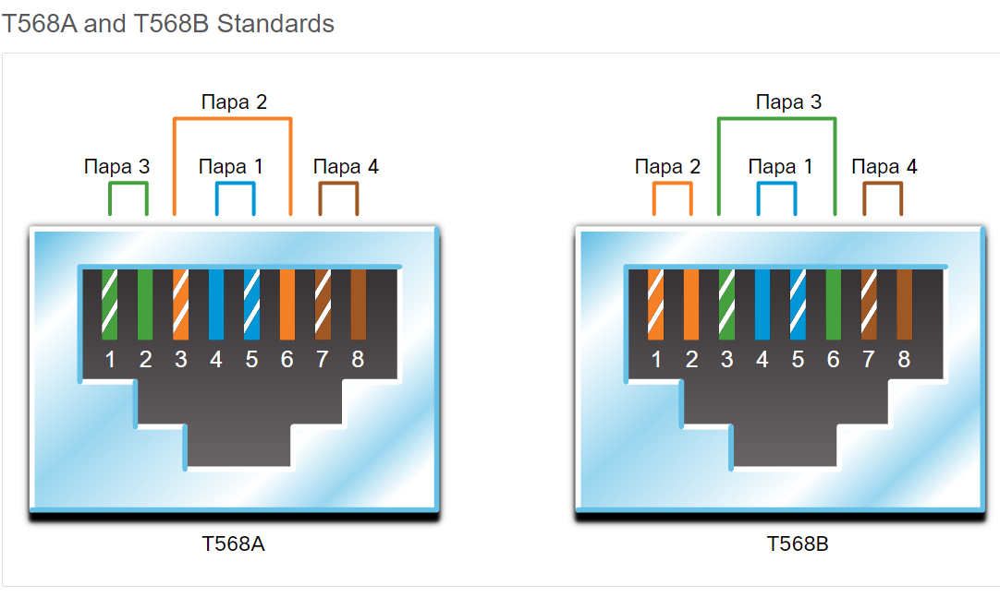
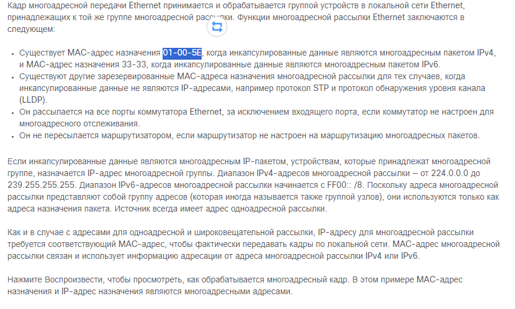
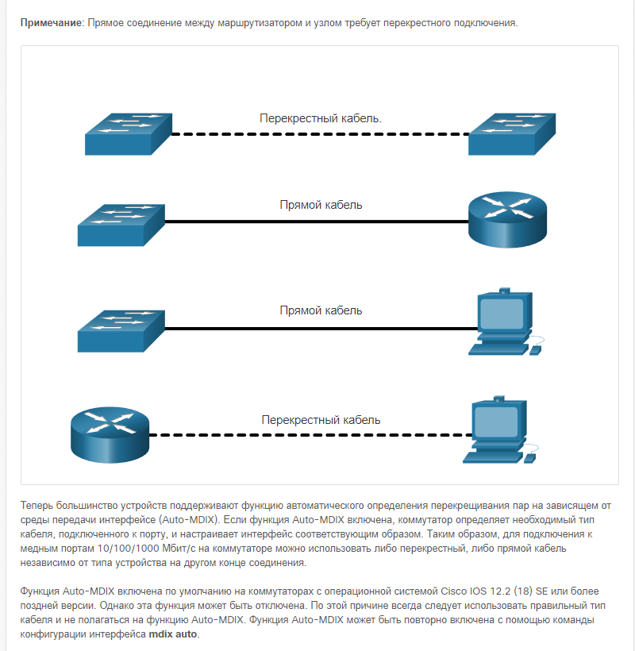
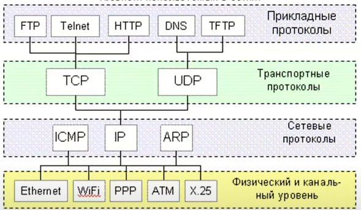
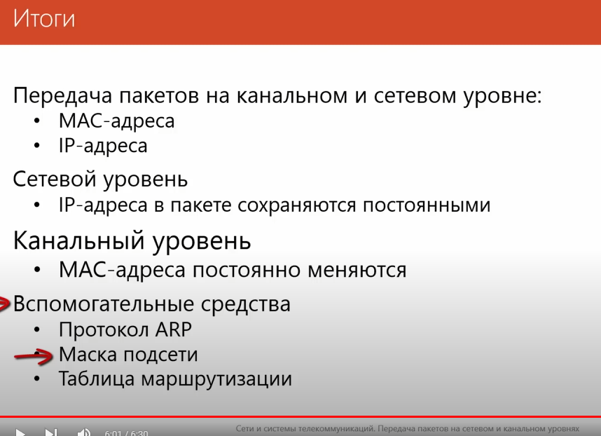

show ip protocols и show ip route
clock rate 64000

router rip
version 2
debug ip rip

4.7.1 / 7.2 - tasks
lab wireshark
lab 7.3.7

windows:
ipconfig

linux:
ifconfig
route -n
route print или netstat -r 

