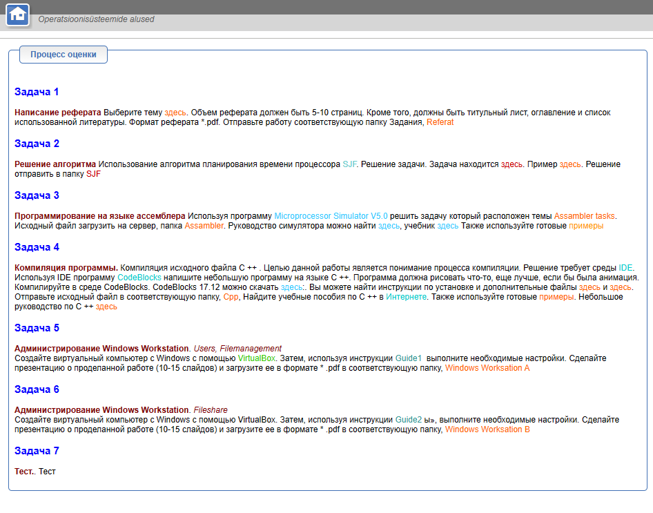

# Задача 1
Написание pеферата Выберите тему [siin](_rsrc/Assambler_tasks_vk.xlsx). Объем реферата должен быть 5-10 страниц. Кроме того, должны быть титульный лист, оглавление и список использованной литературы. Формат реферата *.pdf. Отправьте работу соответствующую папку Задания, Referat

# Задача 2
Решение алгоритма Использование алгоритма планирования времени процессора SJF. Решение задачи. Задача находится здесь. Пример здесь. Решение отправить в папку SJF

# Assembler

Программирование на языке ассемблера Используя программу [Microprocessor Simulator V5.0](http://www.e-ope.usp.ee/public/smz32v50.zip) 
решить задачу который расположен темы Assambler tasks. 
Исходный файл загрузить на сервер, папка Assambler. 
Руководство симулятора можно найти [здесь](_rsrc/sms32v50_lyhi.pdf), учебник [здесь](_rsrc/fel15E330.pdf) 
Также используйте готовые [text](_rsrc/examples)

# Cpp

Компиляция программы. Компиляция исходного файла C ++ . 
Целью данной работы является понимание процесса компиляции. 
Решение требует среды [IDE](https://ru.wikipedia.org/wiki/%D0%98%D0%BD%D1%82%D0%B5%D0%B3%D1%80%D0%B8%D1%80%D0%BE%D0%B2%D0%B0%D0%BD%D0%BD%D0%B0%D1%8F_%D1%81%D1%80%D0%B5%D0%B4%D0%B0_%D1%80%D0%B0%D0%B7%D1%80%D0%B0%D0%B1%D0%BE%D1%82%D0%BA%D0%B8). 
Используя IDE программу [CodeBlocks](https://www.codeblocks.org/) напишите небольшую программу на языке C ++. 
Программа должна рисовать что-то, еще лучше, если бы была анимация. 
Компилируйте в среде CodeBlocks. CodeBlocks 17.12 можно скачать [здесь](_rsrc/codeblocks-17.12mingw-nosetup.zip):.
Вы можете найти инструкции по установке и дополнительные файлы [здесь](_rsrc/CodeBlocks_use_ing.pdf) и [здесь](_rsrc/codeblocks_b.zip). 
Отправьте исходный файл в соответствующую папку, Cpp, Найдите учебные пособия по C ++ в [Интернете](http://kpolyakov.spb.ru/school/c.htm). 
Также используйте готовые примеры. Небольшое руководство по C ++ [здесь](_rsrc/Cpp_vk_3.pdf)

# Задача 5
Администрирование Windows Workstation. Users, Filemanagement
Создайте виртуальный компьютер с Windows с помощью VirtualBox. Затем, используя инструкции Guide1  выполните необходимые настройки. Сделайте презентацию о проделанной работе (10-15 слайдов) и загрузите ее в формате * .pdf в соответствующую папку, Windows Worksation A

# Задача 6
Администрирование Windows Workstation. Fileshare
Создайте виртуальный компьютер с Windows с помощью VirtualBox. Затем, используя инструкции Guide2 ы», выполните необходимые настройки. Сделайте презентацию о проделанной работе (10-15 слайдов) и загрузите ее в формате * .pdf в соответствующую папку, Windows Worksation B

# Задача 7
Тест.. Тест

# Links
https://ru.wikipedia.org/wiki/%D0%9A%D0%BE%D0%BC%D0%BF%D0%B8%D0%BB%D1%8F%D1%82%D0%BE%D1%80

https://blog.skillfactory.ru/glossary/kompilyator/

https://www.youtube.com/watch?v=ysgLg1zIWhU&ab_channel=LearnComputerScience

https://sourceforge.net/projects/orwelldevcpp/

http://www.e-ope.usp.ee/dokeos2/courses/kursused/OPS/www/opsys.html

https://eopearhiiv.edu.ee/e-kursused/eucip/haldus/

http://www.e-ope.usp.ee/dokeos2/courses/kursused/OPS/www/

https://www.youtube.com/@techtitans148

https://www.youtube.com/@ByteByteGo/featured

https://www.youtube.com/@AlekOS

