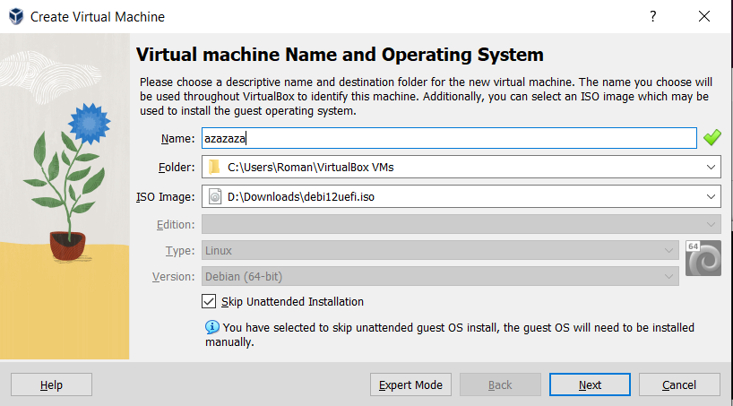
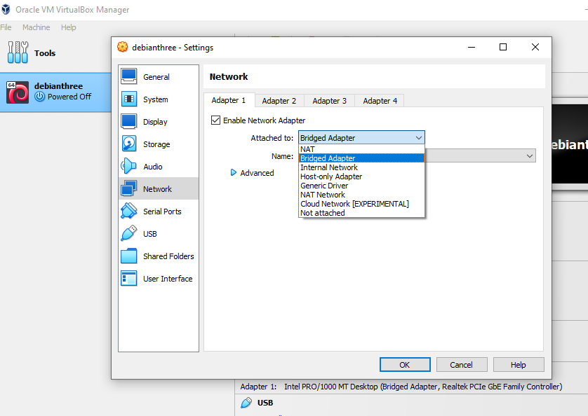
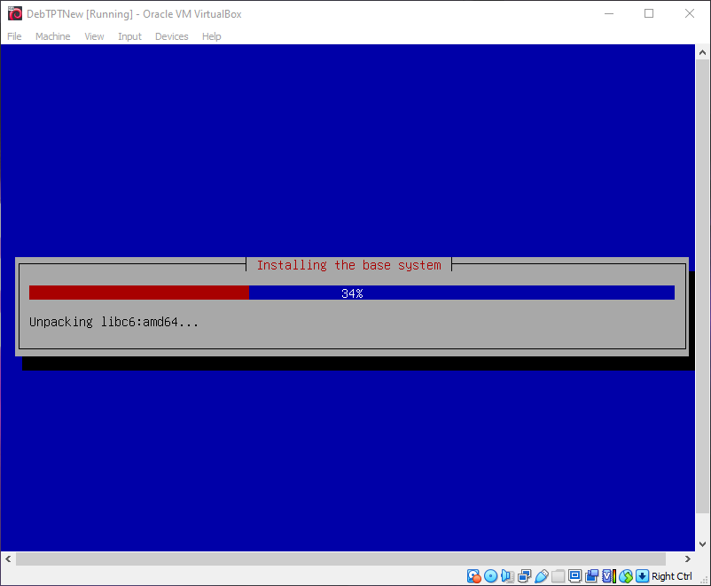
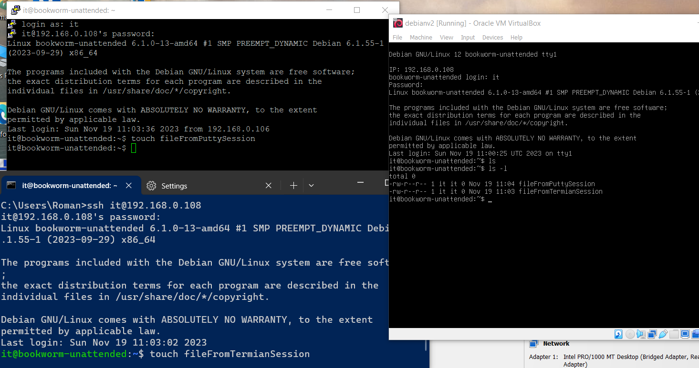
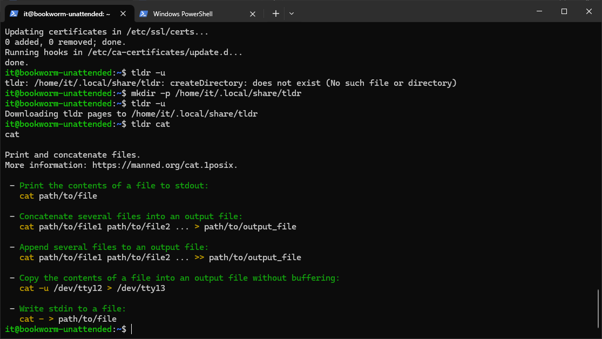

# \_TLDR
Nov.2023
- [\_TLDR](#_tldr)
  - [Intro](#intro)
  - [Пререквизиты и ссылки:](#пререквизиты-и-ссылки)
  - [Ставим WSL и делаем unattented ISO](#ставим-wsl-и-делаем-unattented-iso)
  - [Создаём виртуалку и инсталлим](#создаём-виртуалку-и-инсталлим)
  - [Врубаем и коннектимся](#врубаем-и-коннектимся)
  - [Done](#done)
    - [Альтернатива в виде использвования WSL](#альтернатива-в-виде-использвования-wsl)
    - [Подключаем виртуальный диск в WSL](#подключаем-виртуальный-диск-в-wsl)

## Intro
<details open="open"><summary>Task Brief from Teams</summary>

|                                 |                                                      |
| ------------------------------- | ---------------------------------------------------- |
| Скрипт создания образа          | [deb12iuefi.sh](_rsrc/deb12iuefi.sh)                 |
| Скрипт создания Hyper-V машины  | [newVM.ps1.txt](_rsrc/newVM.ps1.txt)                 |
| Краткий гайд и список вариантов | [TLDR-NB0.md](_rsrc/TLDR-NB0.md)                |
| Гайд по инсталлу                | [Linux-Install-EE.html](_rsrc/Linux-Install-EE.html) |


По заданию
- Сделать unattented образ Debian 
- Поставить на виртуалку, подключиться по ssh
- Поставить bash скриптом TLDR
- Напечатать 3 комманды из своего варианта
- Отправить копию ssh сессии в teams  

Мои расспросы бота o [deb12iuefi.sh и newVM.ps1.txt](_rsrc/chatbot.md)

</details>

## Пререквизиты и ссылки:

**Soft:**
- Виртуальная машина: VirtualBox or Hyper-V or VmWare
- WSL
- Microsoft Windows Terminal и PowerShell 7+
- Для отправки лога сессии в цвете и с финтифлюшками можно использовать любой WYSIWYG editor, например blueGriffon.
- Редакторы текста: nano ed vi (опционально)

**Что почитать в целом:**
- Прикрепы-гайды в тимсе от Кирилла.
- http://veeremaa.tpt.edu.ee/k/linux_ru-2010.txt
- https://habr.com/ru/articles/655275/
- https://skillbox.ru/media/code/chto-takoe-linux-gayd-po-samoy-svobodnoy-operatsionnoy-sisteme/
- https://xakep.ru/2021/11/16/linux-in-30-minutes/


## Ставим WSL и делаем unattented ISO
- Альтернативный краткий путь без установки WSL, который можно пропустить и переходить следущему пункту: скачать уже настроенный **deb12iuefi.iso** , ссылку на который кидали в чате.

**Ставим WSL:**  
- wsl --install  
Подробнее тут: https://learn.microsoft.com/ru-ru/windows/wsl/install

**unattented ISO:**  
- Делаем "прогон" bash скрипта **deb12iuefi.sh**, который на выходе даст нам уже настроеный "unattented" образ для наших нужд.   
Единственное важное замечание что в скрипте скорей всего указаны на данный момент уже неактуальные пути загрузки оригинального дистрибутива Debian, поэтому меняем их (строки 23,27,33)  
*debian-12.**1**.0-amd64-netinst.iso* на <br>
*debian-12.**4**.0-amd64-netinst.iso* 

После выполнения видим следущие файлы, нас интересует конкретно сам ISOшник - debi12uefi.iso:

```bash
r0man@LAPTOP-55DKKGOR:~/inst$ ls -l
total 1409072
-rwxr-xr-x  1 r0man r0man      4312 Dec  1 08:57 deb12.sh
-rw-r--r--  1 r0man r0man 784334848 Dec  1 08:59 debi12uefi.iso
-rw-r--r--  1 r0man r0man 658505728 Dec  1 08:58 debian-12.2.0-amd64-netinst.iso
dr-xr-xr-x 15 r0man r0man      4096 Dec  1 08:59 isofiles
-rw-r--r--  1 r0man r0man      1982 Dec  1 08:59 preseed.cfg
-rw-r--r--  1 r0man r0man     21253 Dec  1 08:59 preseed.cfg.init
r0man@LAPTOP-55DKKGOR:~/inst$
```

`mkdir -p /mnt/c/kit23v`  
`mv debi12uefi.iso /mnt/c/kit-23v/`  
`exit`  

## Создаём виртуалку и инсталлим

- Прогоняем **newvm.ps1**, который создаст нам виртуальную машину в Hyper-V. Подробнее не буду описыать, об этом написано в гайде Кирилла.
Т.к у меня Home редакция винды, то я немогу воспользоваться всеми прелестями Hyper-V, поэтому я буду использовать VirtualBox.

- Создаем новую Linux машину. При создании виртуалки выбирам пунктик Skip Unnatented Installation.  
- Если не хотим заморачиваться с добавлением нового адаптера и прописыванием конфигов и линуксе как у Кирилла - http://kirill.tpt.edu.ee/VBOX_wifi.html. 
То оставляем один адаптер и просто меняем его на Bridged Adapter.




Стандартная процедура.


## Врубаем и коннектимся

- коннектимся через по ssh через putty, или терминал:  
`ssh it@<ip_на_виртуалке>`

password: Passw0rd



O настройках сетевого адаптера в VirtualBox: https://chat.openai.com/share/1d372000-2034-4672-9cab-22fa3e42d17b

**Ставим TLDR:**



- Ручками, либо скриптом:

`nano myscript.sh`

```bash
#!/bin/bash

set -x

sudo apt update && sudo apt upgrade -y
sudo apt install tldr -y
mkdir -p /home/it/.local/share/tldr
tldr -u
```

`chmod +x myscript.sh`  
`./myscript.sh`

## Done

- [myscript.sh](_rsrc/script.sh)
- [session.md](_rsrc/submit.md)

***

### Альтернатива в виде использвования WSL

Так как WSL уже установлен для прогона deb12iuefi.sh, то можно пока обойтись и без VirtualBox/Hyper-V/VmWare для выполнения большинства заданий на текущий момент. 
Да и доступ к файловой системе Linuxa прямо из проводника Windows пройдя по пути <*\\\\wsl.localhost*\> . Всё что нужно будет сделать лишь поставить openssh сервер на него.

Можно воспользоваться [ссылкой](https://jmmv.dev/2022/02/wsl-ssh-access.html) которой поделился Вадим и сделать по их гайду, но если кратко то :

`sudo apt update`  
`sudo apt install openssh-server`  
`sudo service ssh start`

После чего делаем коннект из отдельного окна терминала, либо из Putty:

`ssh <имя_пользователя>@<ip>` , предварительно узнав ip wsl введя там `ip addr`. Либо же, сделать тупо коннект на локалхост  
`ssh <имя_пользователя>@localhost`

`имя пользователя и пароль` - те данные которые мы указывали при установки linux на wsl ( не it:Passw0rd , как было в случае с готовым и настроенным образом Кирилла который ставили на виртуалку)

чат сессия с Ботом  
[SSH на WSL: Подключение и настройка (openai.com)](https://chat.openai.com/share/be68fb52-a9d2-497e-8496-db8e13c7cb14)

### Подключаем виртуальный диск в WSL

[WSL Виртуальный диск (openai.com)](https://chat.openai.com/share/1c48ec8d-6b82-4bd3-b9f0-0f756595adfe)

Но всё ж все операции с монтированием/редактированием/удалением разделов лучше делать пока что на отдельной виртуальной машине в VirtualBox/HyperV.


