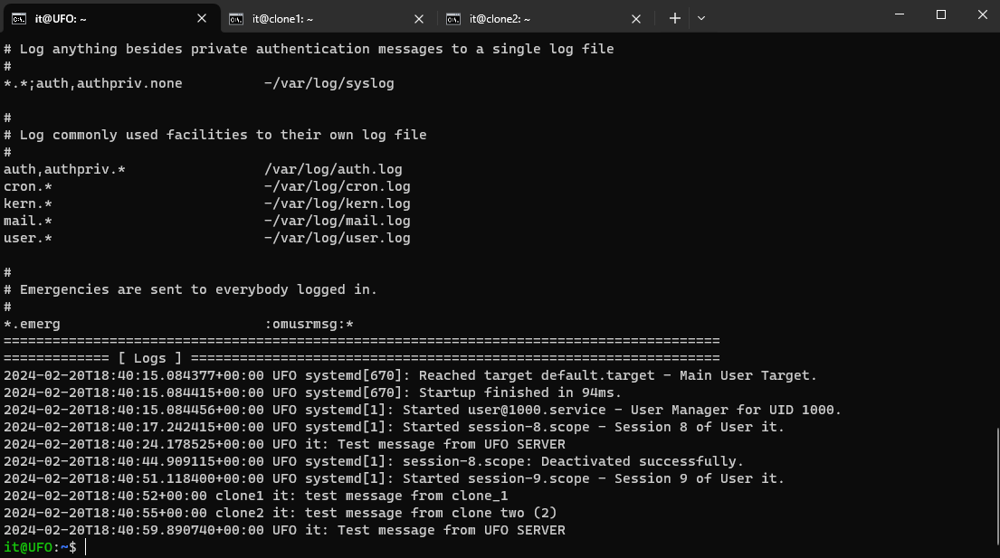

# _ Collect
Feb.2024
- [\_ Collect](#_-collect)
  - [Intro](#intro)
  - [Примерная последовательность действий](#примерная-последовательность-действий)
  - [Main PC ( like rsyslog server )](#main-pc--like-rsyslog-server-)
  - [Cloned PC's ( like rsyslog client )](#cloned-pcs--like-rsyslog-client-)
  - [Testing and complete](#testing-and-complete)
  - [Done](#done)

## Intro
<details open><summary>Task Brief from Teams</summary>

|                                     |                                                  |
| ----------------------------------- | ------------------------------------------------ |
| Краткий экскурс от Кирилла по теме  | [DIAG-06022024.pdf](_rsrc/krl/DIAG-06022024.pdf) |
| То же самое, только в Markdown      | [DIAG-06022024.md](_rsrc/krl/DIAG-06022024.md)   |
| Настройки firewall на всякий случай | [HOSTFW.jpg](_rsrc/krl/HOSTFW.jpg)           |
| Настройки сети в VirtualBox         | [STATICVBOX.jpg](_rsrc/krl/STATICVBOX.jpg)       |

Инструкции
Привет. Мне нужно собрать системные журналы с 2 машин на 3 со статическим ip.
Все 3 используют debian 12.
Помогите мне настроить rsyslog daemon для достижения этой цели.

https://chat.openai.com/share/1a568050-c320-4ce0-b125-c629a1ad17a6

Задача. Отправьте что-нибудь в файл журнала вашего компьютера (CLONE1 и CLONE2)с помощью программы logger
Покажите в файле журнала компьютера 3DA (НЛО), что ваши сообщения были получены.


</details>


Примерная Последовательность действий:  

- Клонируем виртуалку (делаем два клона например, для еще двух хостов в сети)
  - На каждой машине настраиваем адаптер NAT Network в ***/etc/network/interfaces***
  - Делаем хост rename на каждом хосте
-  Загоняем все машины в один NAT Network


## Примерная последовательность действий
- Создаём новую машину c deb12uefi, либо откатываемся снапшотом в самое начало
  
- Делаем NAT Networking как на скрине в прикрепе у Кирилла, а именно - убираем DHCP и делаем проброс портов.


## Main PC ( like rsyslog server )

- Задаём статик IP нашего единственного адаптера в  ***/etc/network/interfaces***

```
# The loopback network interface
auto lo
iface lo inet loopback

allow-hotplug enp0s3
iface enp0s8 inet static
        address 10.0.2.200
        netmask 255.255.255.0
        gateway 10.0.2.2
        dns-search google.com
        dns-nameservers 192.168.0.1
```

- Ребутим

- Теперь можно подсосаться к нему по ssh с компа  
`ssh на it@127.0.0.200 `

- Задаём/меняем имя хоста готовым скриптом [hostrename.sh](_rsrc/hostname.sh). Имя хоста вписывать аргументом скрипта. Делаем это для того что бы не запутаться в дальнейшем в трёх виртуалках

- ставим rsyslog   
`sudo apt install rsyslog -y`

- В файле ***/etc/rsyslog.conf*** делаем раскомент следущих строк. Либо если их там нет, то добавляем.
`sudo nano /etc/rsyslog.conf`

```bash
# Provides UDP syslog reception
module(load="imudp")
input(type="imudp" port="514")
# Provides TCP syslog reception
module(load="imtcp")
input(type="imtcp" port="514")
```
> Эти строки конфигурации rsyslog позволяют серверу принимать syslog-сообщения как по протоколу UDP, так и по протоколу TCP на порту 514. Это полезно для централизованного сбора и анализа логов с нескольких источников в сети. © ChatGPT

- Выключаем виртуалку чтобы сделать Clone.  
`sudo shutdown now`

## Cloned PC's ( like rsyslog client )

Все шаги аналогичные за исключением нескольких вещей:  

- IP-адрес в ***/etc/rsyslog.conf*** естественно задаём другой (201,202,etc..), как и имя хоста  
- На клиенте/ах в ***/etc/rsyslog.conf*** настраиваем правило на перенаправление, а не на приём (как это делали на "сервере"), вместо раскомента, добавляем в конец файла:
```bash
*.* @10.0.2.200:514
```
> Эта строка конфигурации rsyslog определяет правило для перенаправления всех syslog-сообщений на удаленный сервер syslog с IP-адресом 10.0.2.200 и портом 514 по протоколу UDP. © ChatGPT

- Рестартим севис  
`sudo systemctl restart rsyslog`

## Testing and complete

- Добавляем рандомную запись в журнал, а на сервере, и на клиенте:  
`logger "test from UFO Server"`/`logger "test from Clone Client"`

- Смотрим и на клиенте и на сервере. На клиенте должны быть клиентские логи, на сервере и свои и других машин с этой же сети, отправленные ранее:  
`cat /var/log/syslog | tail -n 3`


## Done



- Скрипт для показа interfaces , rsyslog.conf, логов:  
[show.sh](_rsrc/show.sh)

- Лог сессии:  
[session.html](_rsrc/session.html)