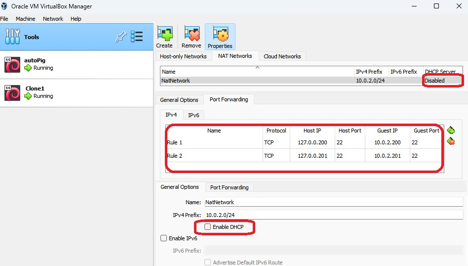
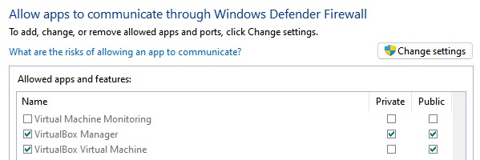

06.02.2024. Log failide kogumine teisest arvutist
-------------------------------------------------

**Ülesanne.**

Saatke logger programmi abil midagi enda arvuti log faili (CLONE1)
Näidake 3da arvuti (UFO) log failis, et teie sõnumid on saabunud.

**Ülesande lahendamine**

1. Asking chatGPT3.5

**`K>`** Hello. I need to collect system logs from 2 machines with static ip on the 3rd machine. All 3 use Debian 12. Help me to configure rsyslog daemon to achieve this goal.

**`ChatGPT`**

Sure, I can help you with that. Here's how you can configure the rsyslog daemon on Debian 12 to collect system logs from two machines with static IPs and store them on a third machine:

Install rsyslog:

Make sure rsyslog is installed on all three machines. You can install it using the following command:

```console
sudo apt-get install rsyslog
```

Configure the rsyslog Server (the third machine):
Open the rsyslog configuration file for editing:

```bash
sudo nano /etc/rsyslog.conf
```

Add the following lines to the end of the file to configure rsyslog as a server:

```graphql
# Provides UDP syslog reception
module(load="imudp")
input(type="imudp" port="514")

# Provides TCP syslog reception
module(load="imtcp")
input(type="imtcp" port="514")
```

This will configure rsyslog to listen for incoming syslog messages on UDP and TCP port 514.

Configure the rsyslog Client (the first and second machines):
Open the rsyslog configuration file for editing:

```bash
sudo nano /etc/rsyslog.conf
```

Add the following line to the end of the file to configure rsyslog as a client and forward logs to the third machine:

```scss
Copy code
*.* @IP_of_third_machine:514
```

Replace 'IP_of_third_machine' with the static IP address of the third machine where you configured rsyslog to act as a server.

Restart rsyslog:

After making the changes, restart the rsyslog service **`on all machines`** for the changes to take effect:

```bash
UFO # systemctl restart rsyslog
CLONE1 # systemctl restart rsyslog
CLONE2 # systemctl restart rsyslog
```

Now, the rsyslog server (third machine) should be able to collect logs from the two client machines. You can check the logs in the files you specified in the rsyslog server configuration.

Connect two machines (builded from debi12uefi.iso) to NatNetwork.



Allow Host Firewall to talk to VirtualBox machine. If connection could not be established, delete and build a new Nat Network, and open firewall when windows asks to open it.



Use static IP for both machines:

`UFO# cat /etc/network/interfaces`

```console
# This file describes the network interfaces available on your system
# and how to activate them. For more information, see interfaces(5).

source /etc/network/interfaces.d/*

# The loopback network interface
auto lo
iface lo inet loopback

# The primary network interface
allow-hotplug enp0s3
iface enp0s3 inet static
    address 10.0.2.200
    netmask 255.255.255.0
    gateway 10.0.2.2
    dns-nameservers 192.168.253.11
```

NB! IP address for `dns-nameservers` is DNS server used by host computer: 

```powershell
ipconfig /all
..
   DNS Servers . . . . . . . . . . . : 192.168.253.11
                                       192.168.253.12
                                       8.8.8.8
..
```

File `CLONE1# cat /etc/network/interfaces`

```console
..
    address 10.0.2.201
..
```

Use hostrename script to set proper host names for UFO and CLONex machines

file `/usr/local/bin/hostrename`

```bash
#! /bin/bash

# uncomment next row to be verbose (debugging)
# set -x

if [ $# -ne 1 ]
then
   echo "Usage: $0 arg. Exiting.."
   exit 0
fi

if [ "$UID" -ne "0" ]
then
  echo "You are not root. Exiting.."
  exit 1
fi

NEW_HOSTNAME=$1

hostname $NEW_HOSTNAME
hostnamectl set-hostname $NEW_HOSTNAME

UNIXTIMENOW=$(date +%s)
mv /etc/hosts /etc/hosts.$UNIXTIMENOW

# sed -Ei silently does not work:)
cat /etc/hosts.$UNIXTIMENOW | \
  sed -E "s/(^127\.0\.1\.1).*$/\1 $NEW_HOSTNAME/" > \
  /etc/hosts

echo "New hostname: $(hostname)"
echo "New IP addresses: $(hostname -I)"
echo
echo "Relogin or run: '$ exec bash' to actualize the prompt"
```

To tune up rsyslog on all machines:  
FOLLOW CHATGPT INSTRUCTIONS AT THE BEGINNIG OF THIS DOCUMENT

Finally test your setup:

1. On CLONE1 machine

```
root@CLONE1:~# logger "TESTING RSYSLOG FORWARDING"
root@CLONE1:~# cat /var/log/syslog | tail -n 1
2024-02-06T13:07:51.268572+00:00 CLONE1 root: 
  TESTING RSYSLOG FORWARDING
```

2. On UFO machine

```
root@UFO:~# cat /var/log/syslog | tail -n 3
..
2024-02-06T13:07:51+00:00 
  CLONE1 root: TESTING RSYSLOG FORWARDING
  ..
root@UFO:~#
```

To personalize your job, please use your own testing message for logger.

**NB! OMA TÖÖ ISIKUPÄRASTAMISEKS KASUTAGE PALUN LOGGERI JAOKS OMA TESTIMISE SÕNUMIT.**
