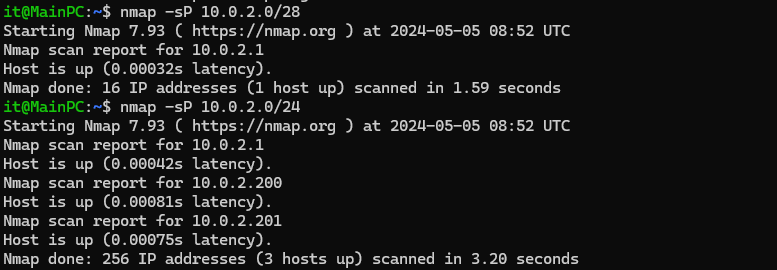
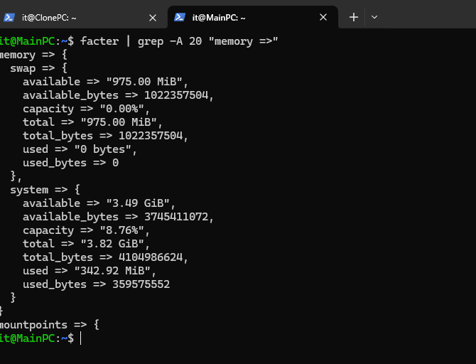
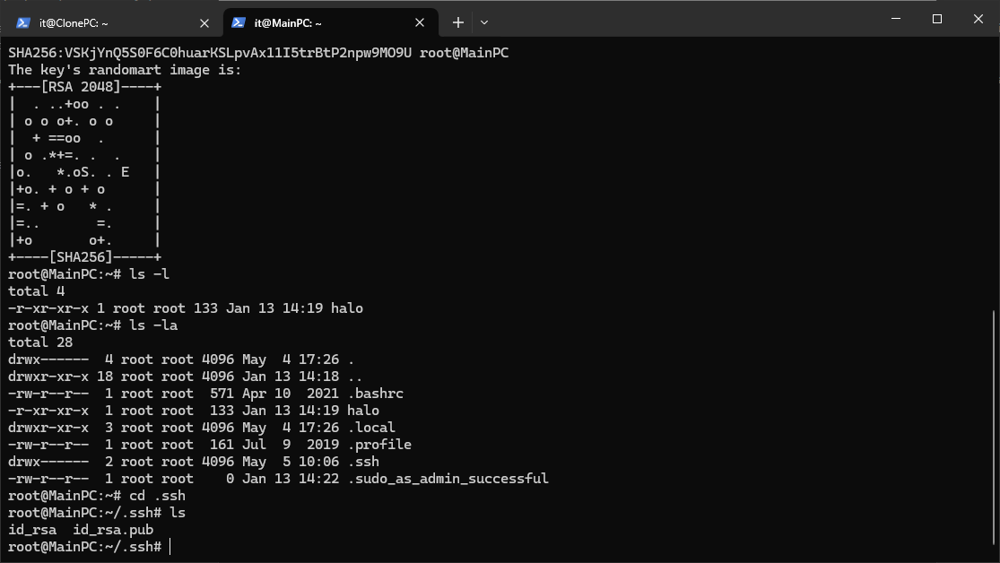
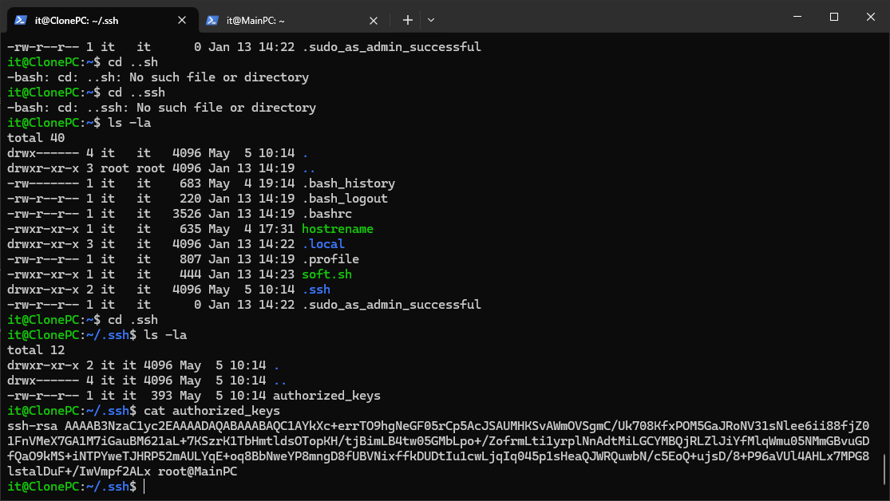
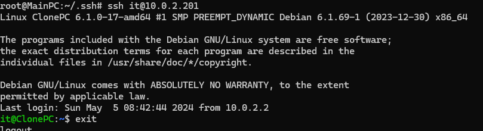
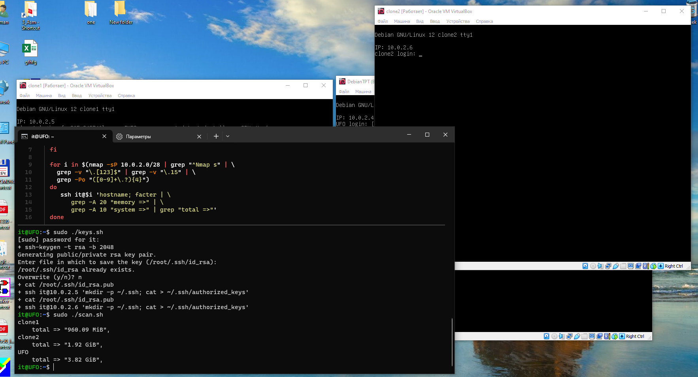

# \_Diagnostics
Feb.2024
- [\_Diagnostics](#_diagnostics)
  - [Intro](#intro)
  - [Prelude](#prelude)
  - [Что есть nmap (Ask ChatGPT)](#что-есть-nmap-ask-chatgpt)
  - [Что есть facter (ask ChatGPT)](#что-есть-facter-ask-chatgpt)
  - [SSH Keys](#ssh-keys)
  - [Edasi](#edasi)


## Intro
<details open><summary>Task Brief from Teams</summary>

|         |                                            |
| ------- | ------------------------------------------ |
| -  // - | [DIAG-00022024.md](_rsrc/DIAG-00022024.md) |
| -  // - | [nmap.png](_rsrc/nmap.png)                 |
| -  // - | [hostrename.sh](_rsrc/hostrename.sh)       |
| -  // - | [KIT23V-o20.txt](_rsrc/KIT23V-o20.txt)     |

</details>

creating a virtual network
creating an ssh connection using public_key (without password)
local network computer detection Using nmap (- sP)
creating the necessary report using the facter program
accumulation and processing of reports with script

https://chat.openai.com/share/0f701a16-189f-4139-975d-b009d005dfc3
https://chat.openai.com/share/33ecca75-9c53-42c6-ae23-51fd8dc5e7db

solve your variant (attached)

************

## Prelude

Предыстория как и в прошлом задании, за исключением установки rsyslog:  
- Создаём новую машину, настраиваем static ip, hostrename. 
- Ставим nmap и facter `sudo apt install facter nmap -y`
- Клонируем виртуалку (два клона напрмер)
- Кидаем машины в NAT Network


## Что есть nmap (Ask ChatGPT)

Nmap (Network Mapper) — это мощная и популярная утилита для сетевого сканирования, разработанная Гордоном Линдсеем и выпущенная под свободной лицензией GNU GPL. Она предоставляет возможности для анализа сети, обнаружения устройств и сервисов, а также проверки безопасности сетевых систем. Вот основные возможности и функции утилиты Nmap:

1. **Сканирование сети**: Nmap может сканировать целые сети или отдельные узлы для определения того, какие устройства доступны в сети и какие сервисы они предоставляют.

2. **Определение операционной системы**: Nmap может попытаться определить операционную систему (ОС) на удаленном узле на основе характеристик и ответов на сетевые запросы.

3. **Поиск открытых портов**: Одна из важнейших функций Nmap — это определение открытых портов на целевом узле. Открытые порты указывают на сервисы, которые доступны на устройстве, а также могут служить индикатором уязвимостей.

4. **Определение сервисов**: Nmap позволяет определить, какие конкретные сервисы и версии программного обеспечения работают на открытых портах.

5. **Сканирование сокращенным временем**: С помощью определенных параметров Nmap можно настроить сканирование таким образом, чтобы оно проходило быстрее, за счет уменьшения количества проверок и сокращения времени ожидания ответов.

6. **Сканирование безопасности**: Nmap может выполнять сканирование для выявления уязвимостей в сетевых устройствах и службах, а также для проверки наличия возможных точек входа для атак.

7. **Скриптование**: Nmap поддерживает скриптование с помощью языка Lua, что позволяет расширять его функциональность для выполнения различных пользовательских задач.

8. **Поддержка различных протоколов**: Nmap поддерживает сканирование как TCP-, так и UDP-портов, что позволяет анализировать различные типы сервисов и протоколов.

Утилита Nmap предоставляет множество возможностей для администраторов сети, системных администраторов и специалистов по информационной безопасности для анализа и обеспечения безопасности сетевых инфраструктур.

- Сканим локалку
`nmap -sP 10.0.2.0/24`



видим 3 хоста онлайн - мы, virtualbox gateway, клон


## Что есть facter (ask ChatGPT)

Facter - это утилита, которая используется для сбора информации о системе и представления этой информации в виде переменных окружения или JSON. Она часто используется в среде управления конфигурациями, такой как Puppet, для автоматизации процесса управления конфигурациями систем.

Основная цель Facter - предоставить информацию о характеристиках операционной системы и оборудования, такие как аппаратное обеспечение, сетевые интерфейсы, операционная система, версия ядра и т. д. Эта информация может быть использована при развертывании и управлении конфигурациями, чтобы принимать решения на основе особенностей конкретной системы.

Например, при использовании инструментов управления конфигурациями, таких как Puppet, Facter может собирать информацию о системе перед применением конфигурационных файлов, чтобы эти файлы могли быть настроены под конкретные характеристики каждой системы.

Facter работает на различных операционных системах, включая Linux, macOS и Windows, и предоставляет удобный способ получения информации о системе из командной строки или из сценариев на языках программирования.

****

- делаем, grep'ом выбираем нужные нам данные из json  
`facter | grep -A 20 "memory =>"`



## SSH Keys


-Заходим в рута  
`sudo -i`
 
Генерим ключ и заходим в папку .ssh, где видим открытый и публичный ключи  
`ssh-keygen -t rsa -b 2048`



Закидываем публичный ключ в другой комп

```
cat ~/.ssh/id_rsa.pub | \
     ssh it@10.0.2.201 \
       'mkdir -p ~/.ssh; cat > ~/.ssh/authorized_keys'

```

- заходим на другой комп и смотрим в папку .ssh , файл authorized keys. видим что файл перекинулся


- пробуем теперь зайти без пароля на второй комп, куда перекинули ключи, всё ок.
`  ssh it@10.0.2.201`



## Edasi

- Первый скрипт создание ключей и перекидывание их на другие машины

```bash
#!/bin/bash

if [ "$UID" -ne "0" ]
then
  echo "You are not root. Exiting.."
  exit 1
fi

ssh-keygen -t rsa -b 2048
cat ~/.ssh/id_rsa.pub | \
     ssh it@10.0.2.201 \
       'mkdir -p ~/.ssh; cat > ~/.ssh/authorized_keys'
       
cat ~/.ssh/id_rsa.pub | \
     ssh it@10.0.2.202 \
       'mkdir -p ~/.ssh; cat > ~/.ssh/authorized_keys'
```

- Второй скрипт проход nmapом, логин в машину если host up, и запуск там nmap

```bash
#!/bin/bash

if [ "$UID" -ne "0" ]
then
  echo "You are not root. Exiting.."
  exit 1
fi

for i in $(nmap -sP 10.0.2.0/28 | grep "^Nmap s" | \
  grep -v "\.[123]$" | grep -v "\.15" | \
  grep -Po "([0-9]+\.?){4}")
do
   ssh it@$i 'hostname; facter | \
      grep -A 20 "memory =>" | \
      grep -A 10 "system =>" | grep "total =>"'
done
```

- Done



***

...xxx