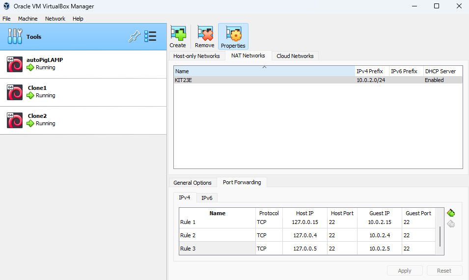

## 24.01.2024 Diagnostics. Gathering information in a virtual local network

creating a virtual network
creating an ssh connection using public_key (without password)
local network computer detection Using nmap (- sP)
creating the necessary report using the facter program
accumulation and processing of reports with script

https://chat.openai.com/share/0f701a16-189f-4139-975d-b009d005dfc3  
https://chat.openai.com/share/33ecca75-9c53-42c6-ae23-51fd8dc5e7db

I. LAMP-down

```bash
apt autoremove --purge php libapache2-mod-php php-mysql -y
rm -rf /etc/php/

# drop database world;
# drop database students;
apt autoremove --purge mariadb-server mariadb-client

a2dissite default-ssl
a2disconf ssl-params
a2edismod headers
mv /etc/apache2/sites-available/default-ssl.conf.0 cat /etc/apache2/sites-available/default-ssl.conf
rm -rf /etc/certificate
a2dismod ssl
systemctl restart apache2
systemctl stop apache2
systemctl disable apache2
apt autoremove --purge apache2
rm -rf /etc/apache2/
rm -rf /var/www/
```

II. Tegelen SSH võtmetega

```bash
UFO$ sudo -i
UFO# ssh-keygen -t rsa -b 2048
UFO# cat ~/.ssh/id_rsa.pub | \
     ssh it@10.0.2.4 \
       'mkdir -p ~/.ssh; cat > ~/.ssh/authorized_keys'
UFO# cat ~/.ssh/id_rsa.pub | \
     ssh it@10.0.2.5 \
       'mkdir -p ~/.ssh; cat > ~/.ssh/authorized_keys'

UFO# ssh it@10.0.2.5
```

III. Local network



IV. Install facter onto CLONE1 ja CLONE2 VM

VM 10.0.2.4

```bash
hostrename CLONE1
apt install -y facter
```

VM 10.0.2.5

```bash
hostrename CLONE2
apt install -y facter
```

**Finally**

10.0.2.15, hostname UFO

```
root@UFO:~# batcat tscan
───────┬─────────────────────────────────────────────────────────
       │ File: tscan
───────┼─────────────────────────────────────────────────────────
   1   │ for i in $(nmap -sP 10.0.2.0/28 | grep "^Nmap s" | \
       │   grep -v "\.[123]$" | grep -v "\.15" | \
       │   grep -Po "([0-9]+\.?){4}")
   2   │ do
   3   │    ssh it@$i 'hostname; facter | \
       │       grep -A 20 "memory =>" | \
       │       grep -A 10 "system =>" | grep "total =>"'
   4   │ done
───────┴─────────────────────────────────────────────────────────

root@UFO:~# bash tscan
CLONE1
    total => "960.56 MiB",
CLONE2
    total => "3.82 GiB",
root@UFO:~#
```