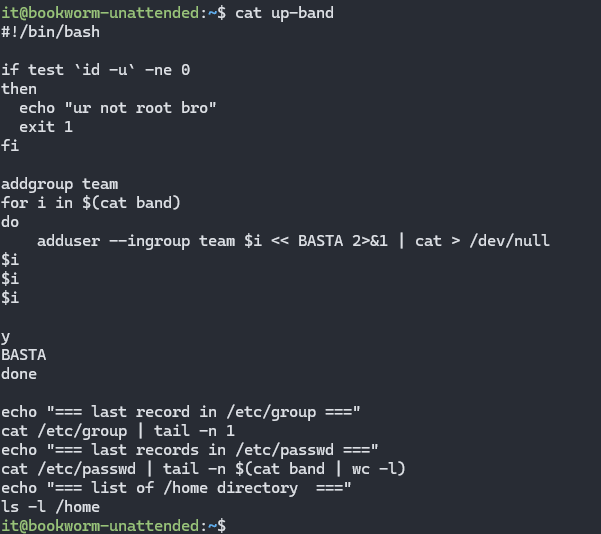
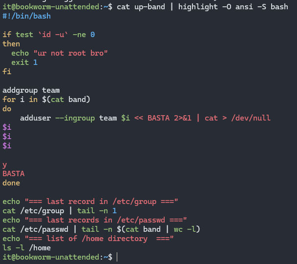

# \_USERS
Nov.2023
- [\_USERS](#_users)
  - [Intro](#intro)
  - [Список юзеров](#список-юзеров)
  - [up-band](#up-band)
  - [down-band](#down-band)
  - [Finish](#finish)

## Intro
<details open="open"><summary>Task Brief from Teams</summary>

|                                                                              |                                                                                                                                  |
| ---------------------------------------------------------------------------- | -------------------------------------------------------------------------------------------------------------------------------- |
| **Гайд и общая инфа по уроку**                                               | [users-MDF 1.md](_rsrc/users-MDF.md)                                                                                             |
| **Пример решения от Кирилла**                                                | [NelusKirillUSERS.html](_rsrc/NelusKirillUSERS.html)                                                                             |
| Гайд по башу                                                                 | [Bash Guide for Beginners](https://tldp.org/LDP/Bash-Beginners-Guide/)                                                           |
| Старые доки у Кирилла на сайте  <br>(возможно часть скриптов нужно редачить) | [addgroup mix](http://kirill.tpt.edu.ee/kasutajad-MB4.html) & [Linuxi Kasutamine](http://kirill.tpt.edu.ee/SUMMARY-USEUNIX.html) |

</details>

1.  *создать список юзеров и показать на консоль*
2.  *создать и продемонстрировать работу скриптов up-users и down-users*
3.  *скопировать сессию и прислать лог*
4.  
> Задания как такого тут нет, нужно просто попрактиковаться в создании bash скриптов и посмотреть как они работают.

Мои расспросы чатбота о скриптах в задействованных в задании [users\_bot](_rsrc/users_bot.md)

## Список юзеров

- Записываю список уникальных пользователей в файл.  vi/nano/cat/ed - вообще всё что создаём (если не не ed,cat - там видно пользовательский ввод), нужно по ТЗ показывать на экран, хоть тем же самым cat'ом.  
    `touch band && nano band`
    
    ```text
    vasya
    petya  
    stepa  
    .....  
    и т.д
    ```
    
- Done:
    
    ```text
    t@bookworm-unattended:~$ cat band
    santa
    capybara
    alpaca
    ```
    

## up-band

<details><summary>Spoiler</summary>Очень долго тупил с этим моментом, т.к у меня не создавались пользователи по up-band, из-за того что в моём скрипте были пользователи с первой большой буквой. Изначально не понимал в чём дело, т.к вывод скрипта не выводит  ошибку при создании пользователя, а подавляет вывод ошибок отправляя в `/dev/null , при этом продолжал дальнейшее своё выполнение, правда какой в этом толк в таком случае ?)</details> 

- Делаем up band (буду делать через nano)  
    `touch up-band && nano up-band`
    
- Показываем  
    `cat up-band`
    
    
    
- Некрасиво, можно раскрасить  
    `sudo apt install highlight  -y`  
    `cat up-band | highlight -O ansi -S bash`
    
      
    Смотрим, уже лучше:
    
- Теперь нужно запустить наш up-band на выполнение, который берет наш список юзеров из band и создаёт пользователя, тут два варианта:
    
    - Либо запускаем сразу  
        `sudo bash up-band`
        
    - Либо перед этим чмодим скрипт с правами на выполнение, чтоб не писать bash каждый раз  
        `chmod +x up-band`  
        `sudo ./up-band`
        
- Done, мы создали свой список юзеров и добавили его в группу "team".
    
    ```text
    it@bookworm-unattended:~$ sudo ./up-band
    Adding group `team' (GID 1001) ...
    Done.
    === last record in /etc/group ===
    team:x:1001:
    === last records in /etc/passwd ===
    santa:x:1001:1001:santa,,y,:/home/santa:/bin/bash
    capybara:x:1002:1001:capybara,,y,:/home/capybara:/bin/bash
    alpaca:x:1003:1001:alpaca,,y,:/home/alpaca:/bin/bash
    dino:x:1004:1001:dino,,y,:/home/dino:/bin/bash
    emily:x:1005:1001:emily,,y,:/home/emily:/bin/bash
    john:x:1006:1001:john,,y,:/home/john:/bin/bash
    barbara:x:1007:1001:barbara,,y,:/home/barbara:/bin/bash
    === list of /home directory  ===
    total 32
    drwx------ 2 alpaca   team 4096 Nov 26 12:14 alpaca
    drwx------ 2 barbara  team 4096 Nov 26 12:14 barbara
    drwx------ 2 capybara team 4096 Nov 26 12:14 capybara
    drwx------ 2 dino     team 4096 Nov 26 12:14 dino
    drwx------ 2 emily    team 4096 Nov 26 12:14 emily
    drwx------ 3 it       it   4096 Nov 26 12:08 it
    drwx------ 2 john     team 4096 Nov 26 12:14 john
    drwx------ 2 santa    team 4096 Nov 26 12:14 santa
    it@bookworm-unattended:~$
    ```
    

&nbsp;

## down-band

- повторяем аналогичные действия с down-band и теперь удаляем созданных пользователей
скриптом.
    
    ```text
    it@bookworm-unattended:~$ sudo ./down-band
    Removing crontab ...
    Removing user `santa' ...
    Done.
    Removing crontab ...
    Removing user `capybara' ...
    Done.
    Removing crontab ...
    Removing user `alpaca' ...
    Done.
    Removing crontab ...
    Removing user `dino' ...
    Done.
    Removing crontab ...
    Removing user `emily' ...
    Done.
    Removing crontab ...
    Removing user `john' ...
    Done.
    Removing crontab ...
    Removing user `barbara' ...
    Done.
    Removing group `team' ...
    Done.
    === last record in /etc/group ===
    _ssh:x:110:
    === last record in /etc/passwd ===
    sshd:x:102:65534::/run/sshd:/usr/sbin/nologin
    === list of /home directory  ===
    total 4
    drwx------ 3 it it 4096 Nov 26 12:17 it
    it@bookworm-unattended:~$
    ```
    

## Finish

- [users\_session.html](https://xprgclr.github.io/tpt/)
- [user\_history.txt](_rsrc/user_history.txt)
