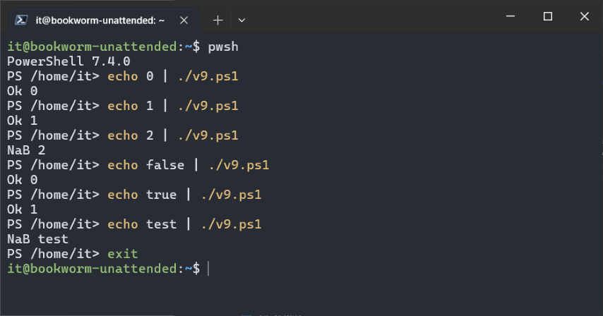
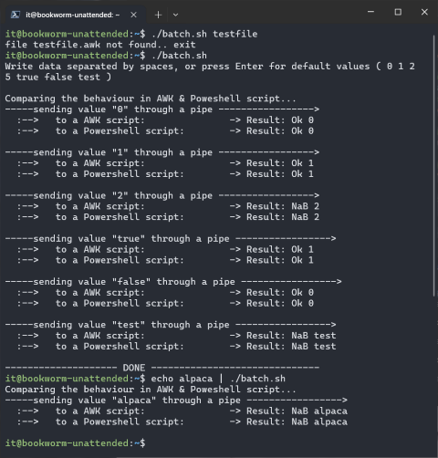
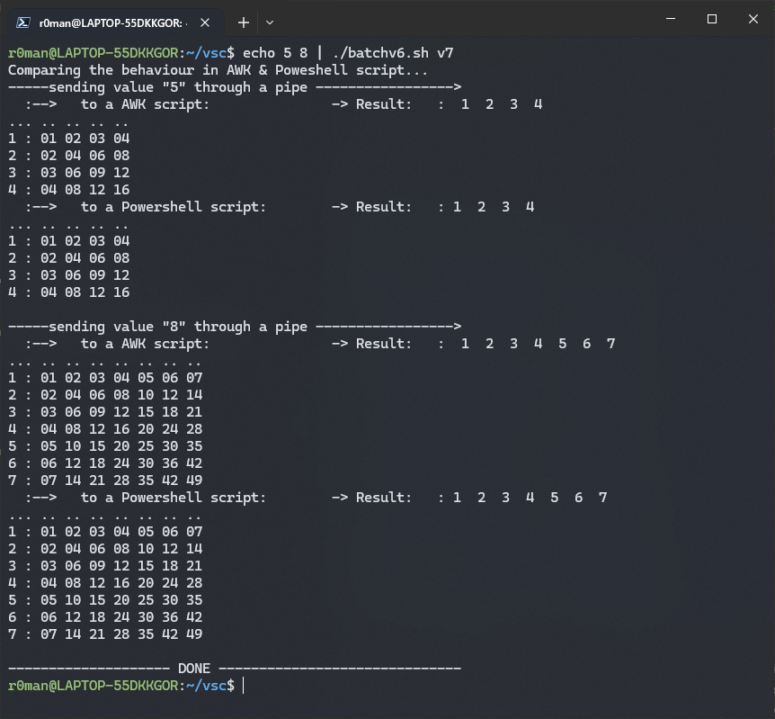
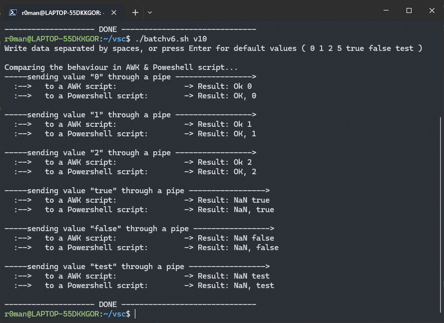
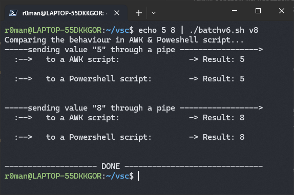

# \_Powershell in Debian
Dec.2023
- [\_Powershell in Debian](#_powershell-in-debian)
  - [Intro](#intro)
  - [free / ip a / df](#free--ip-a--df)
  - [Скрипт установки Powershell на Debian](#скрипт-установки-powershell-на-debian)
  - [Решаем задачу под свой вариант ( v9 )](#решаем-задачу-под-свой-вариант--v9-)
  - [Final](#final)
- [Bonus: Делаем из мухи слона, или пишем делаем Batch-bash скрипт для тестов.](#bonus-делаем-из-мухи-слона-или-пишем-делаем-batch-bash-скрипт-для-тестов)
  - [Первые наброски монстра Франкештейна](#первые-наброски-монстра-франкештейна)
  - [Улучшаем, или двух зайцев разом](#улучшаем-или-двух-зайцев-разом)
  - [Причесываем и проводим трубопровод](#причесываем-и-проводим-трубопровод)
  - [Final\_](#final_)

## Intro
<details open><summary>Task Brief from Teams</summary>

|                                                               |                                        |
| ------------------------------------------------------------- | -------------------------------------- |
| Список вариантов, и полезные линки в конце                    | [K41-awkish.txt](_rsrc/K41-awkish.txt) |
| Гайд по установке pwsh и по каждому из <br> вариантов (почти) | [pwsh-NBS.html](_rsrc/pwsh-NBS.html)   |
| Тоже самое, только в Markdown                                 | [pwsh-NBS.md](_rsrc/pwsh-NBS.md)       |
| Варианты                                                      | var-PWSH-NBR.md ( в тимсе)             |

</details>

>По заданию:
>+ Пришлите лог файл в формате HTML
>+ RAM (free)
>+ NIC's (ip a)
>+ HD (df)
>+ Создайте скрипт установки Powershell на Linux
>+ Решите задачу


[Chatbotdialog](_rsrc/chatbotdialog.html)

## free / ip a / df  

- Сабж одной строкой  
  `echo -e "\nfree:" && free && echo -e "\nip a:" && ip a && echo -e "\ndf:" && df`

  


## Скрипт установки Powershell на Debian 

- Если нет batcat, то ставим:  
  `sudo apt update && sudo apt upgrade && sudo apt install bat -y`

- Копипастим скрипт установки:  
  `touch pwsh-install.sh && nano pwsh-install.sh`

  ```bash
  #! /bin/bash

  if test `id -u` -ne 0
  then
    echo "ur not root bro"
    exit 1
  fi

  batcat $0

  apt-get update
  apt-get install -y wget
  wget https://github.com/PowerShell/PowerShell/releases/download/v7.4.0//powershell_7.4.0-1.deb_amd64.deb
  dpkg -i powershell_7.4.0-1.deb_amd64.deb
  apt-get install -f
  rm powershell_7.4.0-1.deb_amd64.deb
  ```

- Чмодим, запускаем инсталлим pwsh  
  `chmod +x pwsh-install.sh && sudo ./pwsh-install.sh`


## Решаем задачу под свой вариант ( v9 )

Имеем этот [AWK](_rsrc/v9.awk) скрипт. Нужно написать аналогичный, но в Powershell'e. Данные на вход поступают по трубе. Что он делает ? <br>
В зависимости от входных данных выводит либо ОК, либо NaB (Not A Boolean), после чего на той же строке выводит сами данные которые были получены. 
ОК он пишет при 0 и 1. Так же он преобразует true в 1, и false в 0. 
Во всех остальных случаях - NaB.

- Смотрим вывод для всех вариантов и как он себя ведет:  
  `touch v9.awk && nano v9.awk`

  ```text
  it@bookworm-unattended:~$ echo 0 | awk -f v9.awk
  Ok 0
  it@bookworm-unattended:~$ echo 1 | awk -f v9.awk
  Ok 1
  it@bookworm-unattended:~$ echo 2 | awk -f v9.awk
  NaB 2
  it@bookworm-unattended:~$ echo false | awk -f v9.awk
  Ok 0
  it@bookworm-unattended:~$ echo true | awk -f v9.awk
  Ok 1
  it@bookworm-unattended:~$ echo test | awk -f v9.awk
  NaB test
  it@bookworm-unattended:~$
  ```  

  `touch v9.ps1 && nano v9.ps1`


<details><summary>Помучав бота получил изначально такой вариант [Open]</summary>

```powershell
param (
$inputString = "false"
)

$x = switch ($inputString) {
    "true" { 1 }
    "false" { 0 }
    default { $_ }  # $_ представляет собой текущий объект, в данном случае - пустую строку
}

Write-Output "$inputString"

if ($x -match "^(0|1)$") {
    Write-Output "Ok $x"
} else {
    Write-Output "NaB $x"
}
```

</details>


Но Кирилл его не принял и забраковал, т.к данные должны передаваться по трубе, да и выглядит он слишком громоздко..

- Окей, меняем запрос и получаем это:
  ```powershell
  # Чтение значения из конвейера
  $input | ForEach-Object {$n=$_}

  # Преобразование строки в булевское значение
  $n = $n -eq "true" ? 1 : $n
  $n = $n -eq "false" ? 0 : $n

  # Проверка, является ли значение булевским (0 или 1)
  $result = $n -match "^[01]$" ? "Ok $n" : "NaB $n"
  Write-Output $result
  ```

- Повоевав с ботом, получил более лаконичный вариант. Тут нет регулярки ни в каком виде, но в целом выполняет свою ф-цию и работает. В принципе сойдёт, но не совсем то что нужно :  
  ```powershell
  $input | ForEach-Object {
  $n = $_ -eq "true" ? 1 : ($_ -eq "false" ? 0 : $_)
  $result = $n -eq 1 -or $n -eq 0 ? "Ok $n" : "NaB $n"
  Write-Output $result
  }
  ```

## Final

- Не удовлетворившись результатом, ушёл гуглить про базовый синтаксис Powershell и дальше терроризировать ChatGPT, где пришёл к окончательному варианту:

  ```powershell
  # Чтение значения из трубы
  $input | % {$n=$_}
  # Преобразование строки в булевское значение. -replace сойдет за регулярку с натягом)
  $n = $n -replace "true", 1 -replace "false", 0
  # -match Регулярка
  ($n -match "^[01]$") ? 
  "Ok $n" : "NaB $n"
  ```
- Тестим, смотрим.
  
  


- Complete. Всё работает и ведёт себя аналогично AWK скрипту (Единственное замечание что history не отображает команды введеные в "Powershell mode", что впринципе логично).

  - [Сессия](_rsrc/session.html) or [WEB](https://xprgclr.github.io/tpt/pwsh/)
  - [v9.awk](_rsrc/v9.awk)
  - [v9.ps1](_rsrc/v9.ps1)
  - [history](_rsrc/history.txt)
  - [pwsh-install](_rsrc/pwsh-install.sh)

- P.S: Если бы не нужно было "-replacить" true в 1 и false в 0 как это сделално в AWK, то можно было бы сократить свою регулярку до  
`"($n -match "^([01])|(true|false)$") ? "Ok $n" : "NaB $n""`


***

# Bonus: Делаем из мухи слона, или пишем делаем Batch-bash скрипт для тестов.


Нет предела совершенству, поэтому можно автоматизировать bash скриптом сие действо. Скрипт, при запуске которого - принимаются значения по трубе в виде массива ( 0 1 2 false true test ), которые затем уже поочередно по одному передадутся по трубе нашим v9.awk и v9.ps1. Это удобней чем запускать каждый раз отдельно AWK а потом PS скрипт передавая по одному значению за раз.

## Первые наброски монстра Франкештейна
  
- batch.sh  

  ```bash
  #!/bin/bash

  echo "----------=[ Behaviour in AWK script:]=------------- \c"

  echo "# echo 0 | awk -f v9.awk: " && echo 0 | awk -f v9.awk
  echo "# echo 1 | awk -f v9.awk:" && echo 1 | awk -f v9.awk
  echo "# echo 2 | awk -f v9.awk:" && echo 2 | awk -f v9.awk
  echo "# echo false | awk -f v9.awk:" && echo false | awk -f v9.awk
  echo "# echo true | awk -f v9.awk:" && echo true | awk -f v9.awk
  echo "# echo test | awk -f v9.awk:" && echo test | awk -f v9.awk

  echo "-------------------- DONE ------------------------------\n"
  echo "going to powershell mode.... (exec batch.ps1 file)"

  pwsh ./batch.ps1

  echo "...return to the bash"
  exit
  ```

- batch.ps1

  ```powershell
  Write-Host "----------=[ Behaviour in Powershell script:]=----------"

  Write-Host "# echo 0 | v9.ps1: " ; echo 0 | .\v9.ps1
  Write-Host "# echo 1 | v9.ps1: " ; echo 1 | .\v9.ps1
  Write-Host "# echo 2 | v9.ps1: " ; echo 2 | .\v9.ps1
  Write-Host "# echo false | v9.ps1: "; echo false | .\v9.ps1
  Write-Host "# echo true | v9.ps1: "; echo true | .\v9.ps1
  Write-Host "# echo test | v9.ps1: "; echo test | .\v9.ps1

  Write-Host "-------------------- DONE ------------------------------"
  ```

 - result:  

  
1. Первое что бросается в глаза, это повторяющиеся куски кода - значит можно/нужно организовать цикл и менять параметры передаваемые по трубе каждую итерацию цикла.  
2. У нас два отдельных файла, batch.sh и batch.ps1 что усложняет изменения в них. Должен быть один файл.  
3. Скрипт привязан к моему имени файла - v9, это не ок.


## Улучшаем, или двух зайцев разом


Теперь у нас один batch.sh файл, который в свою очередь гонает и awk и ps1 скрипт поочередно по циклу. и выводит результат их работы.

- batch2.sh

  ```bash
  #!/bin/bash

  awk_script="v9"

  # Входные значения
  inputs=(0 1 2 false true test)

  # Запускаем awk/ps1 для каждого входного значения
  for input in "${inputs[@]}"; do
      echo "-----sending ["$input"] to the pipe --------------------"
      echo -n -e with using AWK: "\t-> Result: " && echo "$input" | awk -f "$awk_script.awk"
      echo -n -e with using Powershell: "\t-> Result: " && echo "$input" | pwsh "$awk_script.ps1"
      echo -e
  done

  echo "-------------------- DONE ------------------------------"
  ```
- result:  
  

Осталось только отвязать батч от запуска моего варианта, и от жестко заданных значений, передаваемых по трубе. 

## Причесываем и проводим трубопровод

- batch3.sh
```bash
#!/bin/bash

# Вырубаем отладку, она только мешает тут
set +x

# Проверяем наличие входного параметра
if [ -z "$1" ]; then
  # Входной параметр отсутствует, устанавливаем значение по умолчанию
  script_name="v9_v1"
else
  # Входной параметр присутствует, используем его значение
  script_name="$1"
fi

#shift
# Читаем данные из трубы в массив
#IFS=' ' read -a input_data
read -a input_data

# Если массив пуст, устанавливаем значения по умолчанию
if [ ${#input_data[@]} -eq 0 ]; then
  input_data=(0 1 2 true false five )
fi

echo "Comparing the behaviour in AWK & Poweshell script..."


# Запускаем awk для каждого входного значения
for input in "${input_data[@]}"; do
    # Выводим какие данные читаем в трубе, в очередном цикле
    echo "-----sending ["$input"] to the pipe --------------------"

    # Использует AWK для обработки текущего элемента и вывода результата
    echo -n -e with using AWK: "\t-> Result: " && echo "$input" | awk -f "$script_name.awk" || break

    # Использует PowerShell для обработки текущего элемента и вывода результата
    echo -n -e with using Powershell: "\t-> Result: " && echo "$input" | pwsh "$script_name.ps1" || break

    # Переходим на новую строку
    echo -e
done


echo "-------------------- DONE ------------------------------"
```

[chatbotdia](_rsrc/chatbot.md)

Теперь данные можно передавать по трубе нашему batch, который в свою очередь передает их в awk/ps1 скрипт. А если данных нет, то используем по умолчанию.


## Final_

Помучав бота, и причесав скрипт, добавил чтоб можно было передавать не только данные и но имя файла, для теста других вариантов. Имя файла передается не по трубе, а аргументом/параметром запуска скрипта

- batch.sh

```bash
#!/bin/bash

# Значение по умолчанию для имени файла, без расширения (чтобы не вводить две переменные для*.awk и *.ps1 файла,
# различающихся только расширением (проще прибавить строку расширения к этой переменной, когда будем к ней обращаться)
default_file_name="v9"

# Значение по умолчанию для передаваемых данных по трубе, если мы их не ввели
default_pipe_data=(0 1 2 true false test)

# Вырубаем отладку, она только мешает тут
set +x

# Проверяем наличие входного параметра - пусть это будет имя файла
if [ -z "$1" ]; then
  # Входной параметр отсутствует, устанавливаем ему значение по умолчанию
  script_name="$default_file_name"
else
  # Входной параметр присутствует, используем его значение
  script_name="$1"
fi

# Проверяем, существует ли вообще awk и ps1 файл, нужного нам варианта. Если одного из них нет - выходим
if [ ! -e "$script_name.awk" ] ; then
  echo "file $script_name.awk not found.. exit"
  exit 1
elif [ ! -e "$script_name.ps1" ]; then
  echo "file $script_name.ps1 not found.. exit"
  exit 1
fi

# Чтение данных из трубы, если они доступны
if [ -p /dev/stdin ]; then
    read -a input_data
else
    # Если данных в трубе нет, то просим ввести, либо используем наши значения по умолчанию
    echo "Write data separated by spaces, or press Enter for default values ( 0 1 2 5 true false test ) "
    read -a input_data
    # Использование данных или установка значений по умолчанию
    if [ ${#input_data[@]} -eq 0 ]; then
      input_data=("${default_pipe_data[@]}")
    fi
fi

echo "Comparing the behaviour in AWK & Poweshell script..."

# Запускаем awk для каждого входного значения по трубе
for input in "${input_data[@]}"; do
    # Выводим пользователю какие данные читаем в трубе, в очередном цикле
    echo "-----sending value \""$input"\" through a pipe ----------------->"

    # Используем AWK файл для обработки текущего элемента и вывода результата
    echo -n -e "  :-->\t" to a AWK script: "\t\t-> Result: " && echo "$input" | awk -f "$script_name.awk" || break

    # Используем PowerShell файл для обработки текущего элемента и вывода результата
    echo -n -e "  :--> \t" to a Powershell script: "\t-> Result: " && echo "$input" | pwsh "$script_name.ps1" || break

    # P.S: break нам особо тут уже не нужны, т.к они были тут вписаны тут еще до того как решил сделать проверку на наличие файла
    # в начале скрипта, но пусть уже останется - чтоб наверняка)
    
    # Переходим на новую строку
    echo -e
done


echo "-------------------- DONE ------------------------------"
```

- result:  
  


Таким образом мы передаем данные по трубе в наш batch массивом, далее эти данные так же по трубе перенаправляются в конечный awk/ps1 файл, где передаются поочередно бегая по циклу.
Если данных в трубе нет, то заполняем её значениями по умолчанию.
Если имени файла нет, то используем имя по умолчанию.
Выводим работу каждого из скриптов при определенном значении из трубы.

- Сам скрипт - [batch.sh](_rsrc/batch.sh)
- [WSL Сессия](https://xprgclr.github.io/tpt/pwsh/batch_session.html)
- [Сторис](_rsrc/batch_history.txt)

&nbsp;

---

P.S: Забавы ради можно потестить с другими вариантами - 7,8,10.

|                  |                                             |
| ---------------- | ------------------------------------------- |
|  |  <br>  |


