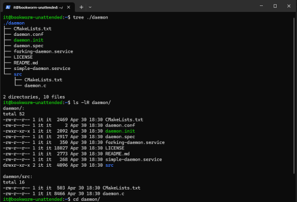
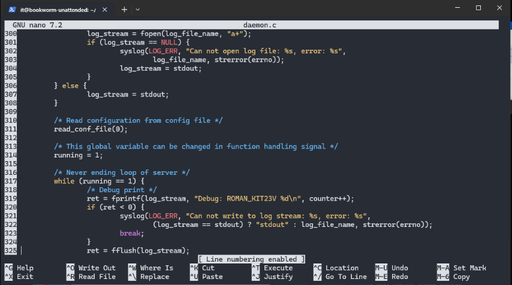
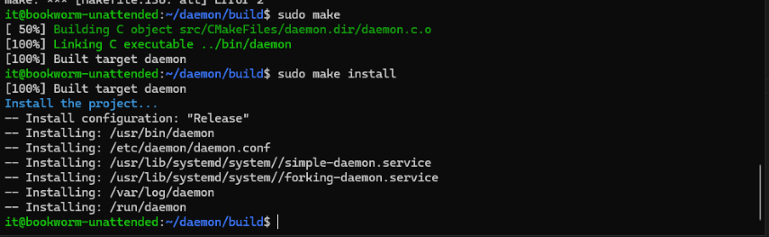
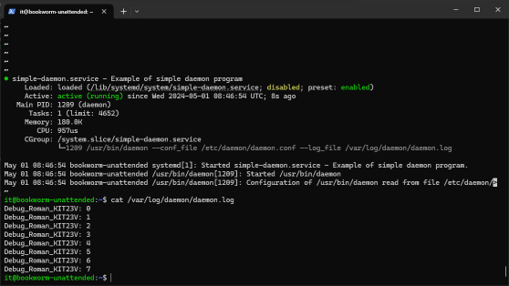

# \_Simple Daemon
Jan.2024
- [\_Simple Daemon](#_simple-daemon)
  - [Intro](#intro)
  - [Тащим пример демона и немного модификации..](#тащим-пример-демона-и-немного-модификации)
  - [Инсталлим демона](#инсталлим-демона)
  - [etc/init.d](#etcinitd)
  - [Запускаем, тестим](#запускаем-тестим)
  - [Done](#done)


## Intro

Примеры [etcinit-up](_rsrc_kirill/etcinit-up) и [etcinit-down](_rsrc_kirill/etcinit-down) от Кирилла

<details open><summary>Task Brief from Teams [Open]</summary>
http://kirill.tpt.edu.ee/simple-daemon-N20.html


</details>

## Тащим пример демона и немного модификации..

-  Тащим с гита пример демона. Можем удалить каталог .git т.к он нам не понадобиться:  
`git clone https://github.com/jirihnidek/daemon`  
`rm -rf daemon/.git`

- Ставим CMake  
`sudo apt install -y build-essential cmake`

- Можем посмотреть структуру каталогов, ну и заодно в виде подробного списка:  
`tree daemon/`  
`ls -lR daemon/`   



- Идём в скачанный каталог:  
`cd ~/daemon` 

- Видим два файла *simple-daemon.service* и *forking-daemon.service*.   
Заходим внутрь и строки **User=daemoner** в обоих файлах меняем на **User=root**

- В *src/daemon.c* меняем на 319 строке "Debug: " на "Debug_Roman_KIT23V: ".    
Посмотреть строки - SHIFT+ALT+3



- Короче, скриптом:
```bash
sed -i "s/User=daemoner/User=root/" "$HOME/daemon/simple-daemon.service"
sed -i "s/User=daemoner/User=root/" "$HOME/daemon/forking-daemon.service"
sed -i "s/Debug: /Debug_Roman_KIT23V: /" "$HOME/daemon/src/daemon.c"
```

## Инсталлим демона

- Создаем каталог build  
`mkdir build`  
`cd build`  

- Делаем сборку проекта (Подробнее [тут](_rsrc/bot.md))  
`sudo cmake -DCMAKE_INSTALL_PREFIX=/usr ../`

- Компилим и "инсталлим"  
`sudo make`  
`sudo make install`




## etc/init.d

- берем скрипт из задания на странице и закидываем в /etc/init.d/simple-daemon  

```bash
#!/bin/sh
### BEGIN INIT INFO
# Default-Start:  2 3 4 5
# Default-Stop: 0 1 6
### END INIT INFO
set -e
# Source function library.
. /lib/lsb/init-functions
# Are we running from init?
run_by_init() {
    ([ "$previous" ] && [ "$runlevel" ]) || [ "$runlevel" = S ]
}
start() {
  /usr/bin/daemon -d \
      --conf_file /etc/daemon/daemon.conf \
      --log_file /var/log/daemon.log
}
stop() {
  killall -9 daemon
}
prg="simple-daemon"
export PATH="${PATH:+$PATH:}/usr/local/bin"
case "$1" in
  start)
        echo "STARTING: $prg"
        start
        ;;
  stop)
        echo "STOPPING: $prg"
        stop
        ;;
  restart)
        echo "RESTARTING: $prg"
        start; stop
        ;;
  status)
        echo "QUERING STATUS: $prg"
  ps -A | grep -i daemon
        ;;
  *)
        log_action_msg "Usage: /etc/init.d/$prg {start|stop|restart|status}" || true
        exit 1
esac
exit 0
```

- Повторяем для /etc/init.d/forking-daemon на странице Кирилла к заданию


## Запускаем, тестим

- **Первый способ, через systemctl:**  
systemctl start|stop|restart|status|enable|disable \ simple-daemon.service  
systemctl start|stop|restart|status|enable|disable \ forking-daemon.service  

Пример:  
Запускаем: `systemctl start simple-daemon`   
Смотрим статус: `systemctl status simple-daemon`  
Останавливаем: `systemctl stop simple-daemon`   
Смотрим лог: `cat /var/log/daemon/daemon.log`  

  

- **Второй способ через service:**  
service simple-daemon start|stop|restart|status  
service simple-daemon start|stop|restart|status  

- **Третий, древний способ, через init.d скрипт:**  
/etc/init.d/simple-daemon start|stop|restart|reload  
/etc/init.d/forking-daemon start|stop|restart|reload  


Так же можно повторить и с forking-daemon
у нас в логе 3 серии, каждая начинается с нуля


## Done

3 скрипта и лог сессии:

- [daemon_up.sh](_rsrc/daemon_up.sh) - установка демона
- [daemon_tests.sh](_rsrc/daemon_tests.sh) - запуск каждого из 2 демонов 3 мя способами, после чего выводиться статус и лог файл. ( итого - 6 серий, каждая начинается с нуля, но т.к демон сразу же останавливается скриптом после запуска то там в каждой серии только 0 и остается.
- [daemon_down.sh](_rsrc/daemon_down.sh) - удаление демона
- [daemon_session.html](_rsrc/daemon_session.html) - сессия с установкой, тестами, и удалением демонов.


