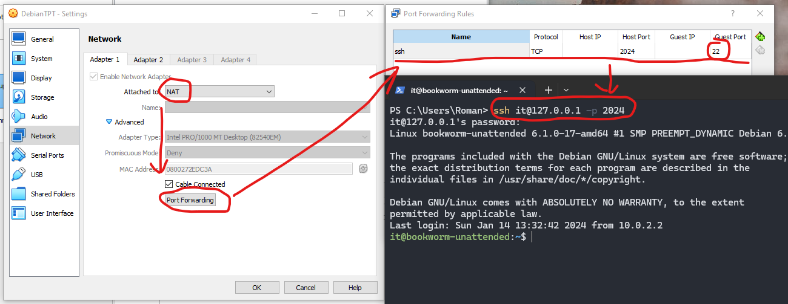
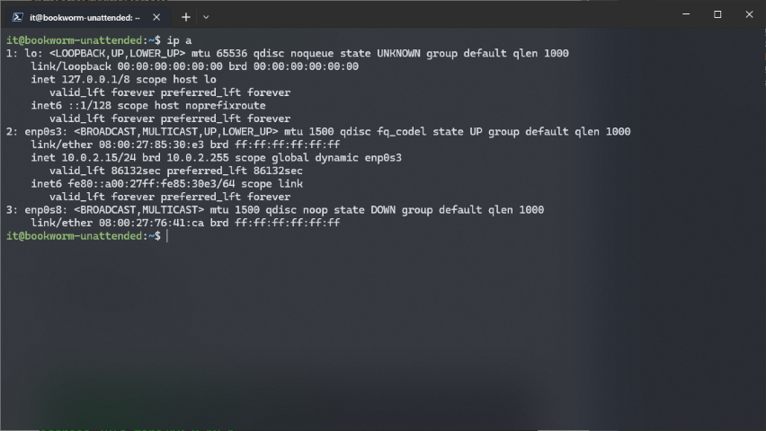
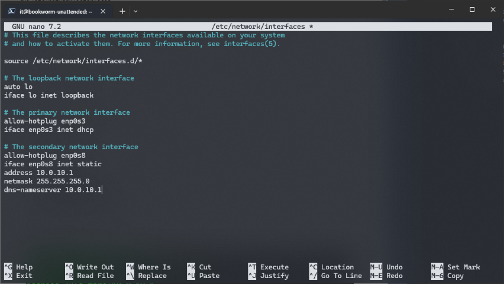
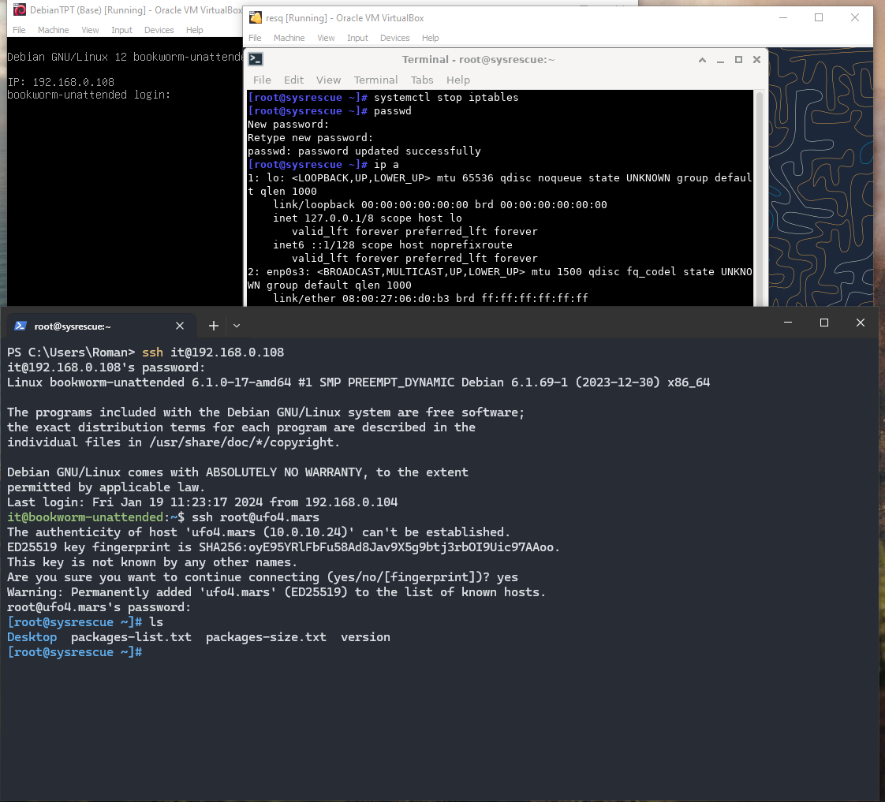

# \_Gateway
Jan.2024
- [\_Gateway](#_gateway)
  - [Intro](#intro)
  - [Прописываем настройки NIC в Gateway/Server](#прописываем-настройки-nic-в-gatewayserver)
  - [Настраиваем Dnsmasq ( dhcp \& dns )](#настраиваем-dnsmasq--dhcp--dns-)
  - [Настраиваем Iptables](#настраиваем-iptables)
  - [Проверяем на Workstation](#проверяем-на-workstation)
  - [Делаем всё скриптом](#делаем-всё-скриптом)
  - [Report:](#report)

## Intro

<details open><summary>Task Brief from Teams [Open]</summary>

|               |                                        |
| ------------- | -------------------------------------- |
| Гайд, задание | [GATEWAY-o0B.md](_rsrc/krl/GATEWAY-o0B.md) |

</details>

>Нужно создать две виртуалки, одна из которых будет выступать роутером (Gateway), вторая клиентом (Workstation). Наш Workstation будет выходить в инет через запущенный Gateway.

  


О используемом/устанавливаемом софте здесь и в дальнейшем:  

- **DNSmasq** - это легкий и удобный инструмент, который предоставляет функции DNS-сервера, DHCP-сервера, а также возможности для сетевого обслуживания и кэширования DNS-запросов. Он часто используется в небольших сетях, домашних сетях или малых предприятиях.
- **Iptables** - это мощный инструмент для управления правилами файрвола в операционных системах Linux. Он позволяет администраторам настраивать правила безопасности, фильтрации пакетов и перенаправления сетевого трафика
- **Facter** - это инструмент, разработанный для сбора информации о конфигурации и характеристиках компьютерной системы. Он часто используется в инфраструктуре управления конфигурацией, такой как Puppet, для автоматической настройки и управления конфигурацией серверов
- **Nmap (Network Mapper)** - это мощный инструмент для сканирования сети и анализа безопасности, который используется для обнаружения устройств в сети, определения открытых портов на этих устройствах, определения типа операционной системы и многого другого.
- **RSyslog** - это мощный и гибкий инструмент для управления журналами системы в среде операционной системы Linux. Он предоставляет средства для сбора, обработки и пересылки журналов с различных устройств и приложений

Дополнения:
- Везде где у Кирилла встречается eth0 и eth1 - у меня заменено на enp0s3 и enp0s8 соотв-нно.
- Делаем все дальнейшие комманды из под рута, что бы не вводить sudo каждый раз - `sudo -i`
- Делаем копии файлов, которые мы меняем. Сохраняя оригинал с расширением **0** `cp файл файл.0`
- предварительно ставим dnsmasq и iptables `apt-get install dnsmasq && apt install iptables -y`
- предварительно ставим для теста в конце задания `apt install -y ruby facter`
- спрашиваем [ChatGPT](_rsrc/chatbot.md) о том, что тут вообще происходит.


## Прописываем настройки NIC в Gateway/Server

**Virtual Box ADAPTER_1:**
- Либо ставим Bridged Adapter и коннектимся по выданному ipшнику от домашнего роутера.
- Либо ставим NAT и пробрасываем 22 порт, чтобы можно было связаться в машиной по ssh на виртуалке:




**Virtual Box ADAPTER_2:**
- Добавляем второй NIC в VirtualBox в виде - "Internal Network" (аналог "Private Switch" в случае Hyper-V).
***

- Запускаем наш будущий Gateway/Server и проверяем, есть ли второй NIC который смотрит внутрь нашей сети ?   
`ip a`:  



- Видим что NIC добавился (enp0s8), но он не настроен. Первым делом идём в interfaces, предварительно сохранив копию  
`cp /etc/network/interfaces /etc/network/interfaces.0 && nano /etc/network/interfaces`. 

```
allow-hotplug enp0s8
iface enp0s8 inet static
address 10.0.10.1
netmask 255.255.255.0
gateway 10.0.10.1
dns-search google.com
dns-nameservers 10.0.10.1
```

- Должно быть что-то типо такого:  



- Для вступления изменений в силу либо делаем ребут `reboot now`, либо перезапускаем службу networking  
`systemctl restart networking`

- Убеждаемся в том, что мы задали второму NIC ip (как минимум) и что он работает - `ip a`

```
...
3: enp0s8: <BROADCAST,MULTICAST,UP,LOWER_UP> mtu 1500 qdisc fq_codel state UP group default qlen 1000
    link/ether 08:00:27:76:41:ca brd ff:ff:ff:ff:ff:ff
    inet 10.0.10.1/24 brd 10.0.10.255 scope global enp0s8
       valid_lft forever preferred_lft forever
    inet6 fe80::a00:27ff:fe76:41ca/64 scope link
       valid_lft forever preferred_lft forever
...      
```

## Настраиваем Dnsmasq ( dhcp & dns )

- Редактируем /etc/dnsmasq.conf.   
`cp /etc/dnsmasq.conf /etc/dnsmasq.conf.0 && nano /etc/dnsmasq.conf`

```
interface=enp0s8
address=/ufo.mars/10.0.10.1
dhcp-range=enp0s8,10.0.10.1,10.0.10.25,12h

```
> Что значат эти настройки ?
>  1) Указывает DNSmasq использовть интерфейс enp0s8 для обработки DNS и DHCP запросов. DNSmasq  будет прослушивать этот интерфейс для всех запросов
>  2) Все запросы для ufo.mars будут резолвиться на 10.0.10.1. Своего рода внутренняя DNS-запись для локальной сети
>  3) Определяет диапазон IP-адресов выдаваемый DHCP клиентам на интерфейсе enp0s8. Лизинг адресов на 12 часов.


- Редактируем /etc/hosts  
`cp /etc/hosts /etc/hosts.0 && nano /etc/hosts`

```
10.0.10.20      ufo0.mars
10.0.10.21      ufo1.mars
10.0.10.22      ufo2.mars
10.0.10.23      ufo3.mars
10.0.10.24      ufo4.mars
10.0.10.25      ufo5.mars

```
> Этот файл используется для соответствия ip-адресов именам хостов. Прежде чем зарезолвить имя хоста в IP-адрес, ОС сначала проверяет этот файл, перед тем как обратиться к DNS серверу. Аналог такого же файла в windows ( C:\Windows\System32\drivers\etc\hosts )
 
- Делаем перезапуск DNSmasq:   
`systemctl restart dnsmasq`

После этого можно запускать компьютеры в той же "Internal Network", где им будет выдаваться IP
от нашей основной машины. Теперь машины видят друг друга и могут обращаться друг к другу. Но мы пока не можем выходить с клиента в интернет.

## Настраиваем Iptables

> Директория /etc/network/if-up.d представляет собой место в операционной системе Linux, где хранятся скрипты, которые автоматически выполняются при активации сетевого интерфейса (поднятии интерфейса). Когда сетевой интерфейс активируется, операционная система запускает скрипты из этой директории.
> Скрипты в директории /etc/network/if-up.d выполняются в лексикографическом (алфавитном) порядке. Это значит, что файлы будут запускаться в порядке, определяемом их именами. © ChatGPT


- Создаём скрипт настроек в в этой директории:  
`/etc/network/if-up.d/00-firewall`

```
#!/bin/sh
# Reload the iptables rules and activate forwarding

set -e

# delete all existing rules.
iptables -Z             # zero counters
iptables -F             # flush (delete) rules

iptables -t mangle -F
iptables -X             # delete all extra chains

# If you want to clear the chains, then clear the chains:
iptables --policy INPUT   ACCEPT;
iptables --policy OUTPUT  ACCEPT;
iptables --policy FORWARD ACCEPT;

# Masquerade.
iptables -t nat -A POSTROUTING -o enp0s3 -j MASQUERADE

# Enable routing.
echo 1 > /proc/sys/net/ipv4/ip_forward

```

- Чмодим и запускаем ( можно и перезапустить iptables )
`chmod +x /etc/network/if-up.d/00-firewall && /etc/network/if-up.d/00-firewall`

## Проверяем на Workstation 

**Virtual Box ADAPTER_1:**
Ставим "Internal Network" как и на роутере на втором NIC

*NB! В адаптерах обоих машин у Internal Network должно быть идентичное имя сети ("Name" в настройках).*

- Запускаем клиента ( если systemresque то - `startx`). Идём в браузер, пытаемся выйти в инет. Всё ок:  


- На рабочей машине ставим пасс по которому потом будем коннектиться `systemctl stop iptables && passwd`  

- Можно приконнектисся по ssh к Workstation из Gateway. Рутом по ip или по имени хоста:  



- DONE.


## Делаем всё скриптом
 - Server  
[Router_up](_rsrc/router_up.sh)   
[Router_down](_rsrc/router_down.sh)  

- Скрипты для теста  
[Report Gateway](_rsrc/report_gw.sh)  
[Report Workstation](_rsrc/report_ws.sh)  
 
## Report:

[Workstation](https://xprgclr.github.io/tpt/gateway/report_ws2.html)  
[Gateway](https://xprgclr.github.io/tpt/gateway/report_gw2.html)


