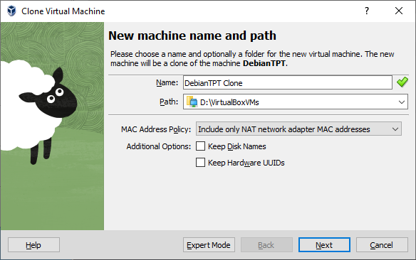
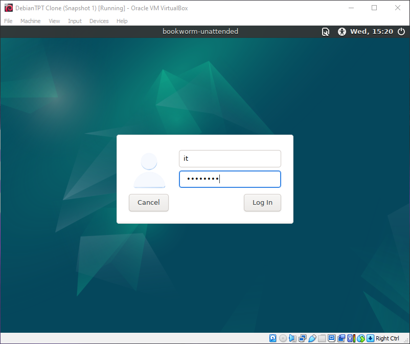

# \_WS with GUI to work with DIY rooter aka GATEWAY
Jan.2024
- [\_WS with GUI to work with DIY rooter aka GATEWAY](#_ws-with-gui-to-work-with-diy-rooter-aka-gateway)
  - [Intro](#intro)
  - [Пререквезиты](#пререквезиты)
  - [Создаём Workstation](#создаём-workstation)
  - [Создаем Gateway](#создаем-gateway)
  - [Делаем из Gateway Сервер](#делаем-из-gateway-сервер)
  - [Юзаем Workstation](#юзаем-workstation)

***

## Intro

<details open><summary>Task Brief from Teams</summary>

|               |                                        |
| ------------- | -------------------------------------- |
| create autoPIG machine | [newVM.ps1.txt](_rsrc/newVM.ps1.txt) |
| Скрипт для установки "бонусов" под наш роутер | [Apache-Emscripten-o0C.md](_rsrc/Apache-Emscripten-o0C.md)|
| Скрипт для установки GUI под наш Workstation | [GUIWS-o0C.md](_rsrc/GUIWS-o0C.md) |
| Create autoWS machine | [newWS.ps1 1.txt](<_rsrc/newWS.ps1 1.txt>) |
| Скрипт на основепрошлого урока для - router-up/down | [GATEWAY-o0C.md](_rsrc/GATEWAY-o0C.md) |

</details>


## Пререквезиты

Задании на основе предыдущего. Только вместо RescueISO у нас будет клон нашей Debian машины, на которую мы будем ставить "GUI" (LightDM).
На гейтвей будет в роли сервера с Apache, EmScripten, DosBox и SDL2

## Создаём Workstation
- Вместо RescueISO используем голый дебиан. Клонируем нашу машину. Ставим ей internal network.
- Берем наш "чистый" Debian. debi12uefi.iso. Либо делаем клон того состояния, где мы не делали её еще в роли сервера. Чтобы не убирать те настройки



- Настраиваем WS, а конкретней - ставим GUI скриптом: 

```bash
#!/bin/bash

if [ "$UID" -ne "0" ]
then
  echo "You are NOT root"
  exit 1
fi

apt update
apt upgrade -y
apt install systemd-timesyncd
systemctl restart systemd-timesyncd
timedatectl
systemctl status systemd-timesyncd --no-pager | tail -n 1

apt-get -y install wget
apt-get -y install xserver-xorg lxde lightdm lxappearance
apt -y install build-essential module-assistant dkms wget

apt -y install lightdm lxde task-lxde-desktop
echo "DISPLAY_MANAGER=lightdm" > /etc/default/display-manager

cp /etc/lightdm/lightdm.conf /etc/lightdm/lightdm.conf.0
cat << EOF >> /etc/lightdm/lightdm.conf

greeter-session=lxdm-gtk2
user-session=lxde
EOF
```

- Чмодим, запускаем
`chmod +x gui_up.sh`
`sudo ./gui_up.sh`

- Ждём пока всё скачается и установится (~10мин), после установки делаем рестарт сервиса и проходим аутентификацию:  
`systemctl restart lightdm`  


- и наша виртуалка (в VirtualBox) вместо сухого приветствия приобретает след. вид:  



- Вырубаем, делаем снапшот на всякий случай).

## Создаем Gateway
- Всё то же самое что и в предыдущем задании. Или делаем всё сразу скриптом - [Router UP Script](../gateway/_rsrc/router_up.sh)


## Делаем из Gateway Сервер

- Возвращаемся на Gateway и настраиваем его дальше (ставим апач, досбокс и т.д ) [Скриптом](_answ/apache_up.sh)
```bash
sudo apt update
sudo apt upgrade -y
sudo apt install apache2 -y
systemctl status apache2 --no-pager

sudo apt install python-is-python3 git wget -y
sudo apt install autogen automake autotools-dev -y
sudo apt install cmake build-essential -y
sudo apt install software-properties-common -y
sudo apt install nodejs unzip -y

mkdir ~/apache-emscripten
```

- Тянем  SDL, emscripten, dosbox к нему и компилим их на машине:  
```bash
cd ~
git clone https://github.com/libsdl-org/SDL.git -b SDL2
cd SDL/
mkdir build
cd build
../configure
make
sudo make install

ip a # selleks et konrrollida apache tööd
cd ~
git clone https://github.com/emscripten-core/emsdk.git
ls -l
cd emsdk/
./emsdk install latest
./emsdk activate latest
. ./emsdk_env.sh

cd ~
git clone https://github.com/dreamlayers/em-dosbox.git
cd em-dosbox/
./autogen.sh
./configure
emconfigure ./configure
make -j 2
```

-  Делаем dummy и проверяем
```bash
cd ~/emsdk/upstream/emscripten
./emcc -v
cat << BASTA > hello.c
#include <stdio.h>

int main() {
  printf("hello, world!\n");
  return 0;
}
BASTA
./emcc hello.c

node a.out.js

./emcc hello.c -o hello.html
sudo cp hello.* /var/www/html
# hello_sdl now available as http://<vm_ip>/hello.html
```

- Проверяем, всё ок:  


- Делаем что-то покрасивей:
```bash
cat << BASTA > hello_sdl.cpp
#include <stdio.h>
#include <SDL/SDL.h>

#ifdef __EMSCRIPTEN__
#include <emscripten.h>
#endif

int main(int argc, char** argv) {
  printf("hello, world!\n");

  SDL_Init(SDL_INIT_VIDEO);
  SDL_Surface *screen = SDL_SetVideoMode(256, 256, 32, SDL_SWSURFACE);

#ifdef TEST_SDL_LOCK_OPTS
  EM_ASM("SDL.defaults.copyOnLock = false; SDL.defaults.discardOnLock = true; SDL.defaults.opaqueFrontBuffer = false;");
#endif

  if (SDL_MUSTLOCK(screen)) SDL_LockSurface(screen);
  for (int i = 0; i < 256; i++) {
    for (int j = 0; j < 256; j++) {
#ifdef TEST_SDL_LOCK_OPTS
      // Alpha behaves like in the browser, so write proper opaque pixels.
      int alpha = 255;
#else
      // To emulate native behavior with blitting to screen, alpha component is ignored. Test that it is so by outputting
      // data (and testing that it does get discarded)
      int alpha = (i+j) % 255;
#endif
      *((Uint32*)screen->pixels + i * 256 + j) = SDL_MapRGBA(screen->format, i, j, 255-i, alpha);
    }
  }
  if (SDL_MUSTLOCK(screen)) SDL_UnlockSurface(screen);
  SDL_Flip(screen);

  printf("you should see a smoothly-colored square - no sharp lines but the square borders!\n");
  printf("and here is some text that should be HTML-friendly: amp: |&| double-quote: |\"| quote: |'| less-than, greater-than, html-like tags: |<cheez></cheez>|\nanother line.\n");

  SDL_Quit();

  return 0;
}
BASTA
./emcc hello_sdl.cpp -o hello_sdl.html
sudo cp hello_sdl.* /var/www/html/
# hello_sdl now available as http://<vm_ip>/hello_sdl.html
```

- Работает: 


- Заключительное ?
```bash
cd ~/emsdk/
. ./emsdk_env.sh

cd ~/em-dosbox/src/
wget https://www.oocities.org/KindlyRat/GWBASIC.EXE.zip
unzip GWBASIC.EXE.zip
./packager.py gwbasic GWBASIC.EXE
# DON'T WORRY. BE HAPPY. WARNINGS ONLY BELOW:
# ignoring legacy flag --no-heap-copy 
#    (that is the only mode supported now)
# Remember to build the main file with 
#    `-sFORCE_FILESYSTEM` so that it 
#    includes support for loading this file package
sudo cp gwbasic.html GWBASIC.EXE /var/www/html/
sudo cp gwbasic.data /var/www/html/
sudo cp dosbox.* /var/www/html/
# dosbox now available as http://<vm_ip>/dosbox.html
# gwbasic now available as http://<vm_ip>/gwbasic.html

mkdir -p STRYKER
cd STRYKER
wget -c https://image.dosgamesarchive.com/games/strykerfw.zip
unzip strykerfw.zip
cd ..
./packager.py stryker $(pwd)/STRYKER/ STRYKER.EXE
sudo cp stryker.html stryker.data /var/www/html
# game now available as http://<vm_ip>/stryker.html
```
- И всё вместе одним скриптом:
[apache_up](_answ/apache_up.sh)

## Юзаем Workstation
- Делаем ДЗ\ставим Heretic например
```bash
#!/bin/bash

# for Heretic game
# run after Apache-Emscripten-o0C.md script !

cd ~/emsdk/
. ./emsdk_env.sh
cd ~/em-dosbox/src/

mkdir -p HERETIC
cd HERETIC
wget -c https://image.dosgamesarchive.com/games/htic-box.zip
unzip htic-box
cd ..
./packager.py heretic $(pwd)/HERETIC/ HERETIC.BAT
sudo cp heretic.html heretic.data /var/www/html
# game now available as http://<vm_ip>/HERETIC.html
```

- Done:


