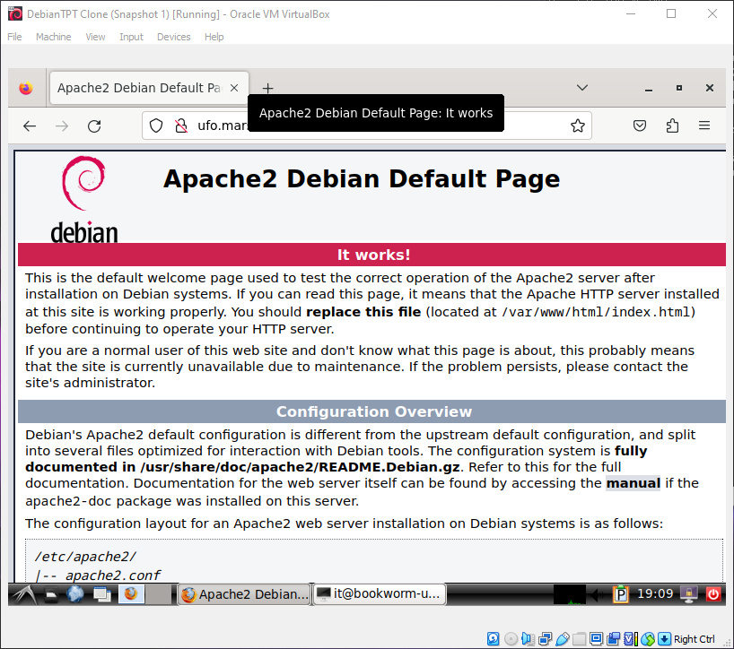
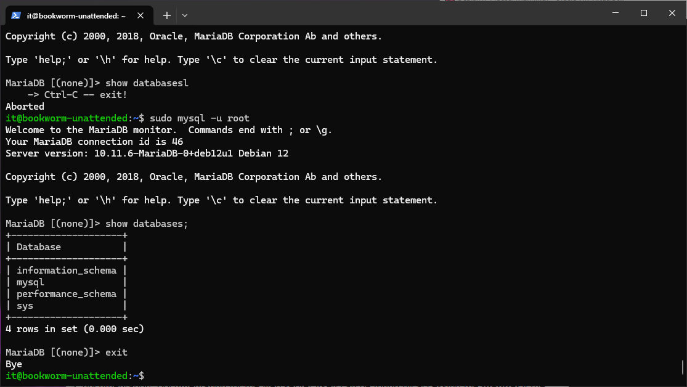
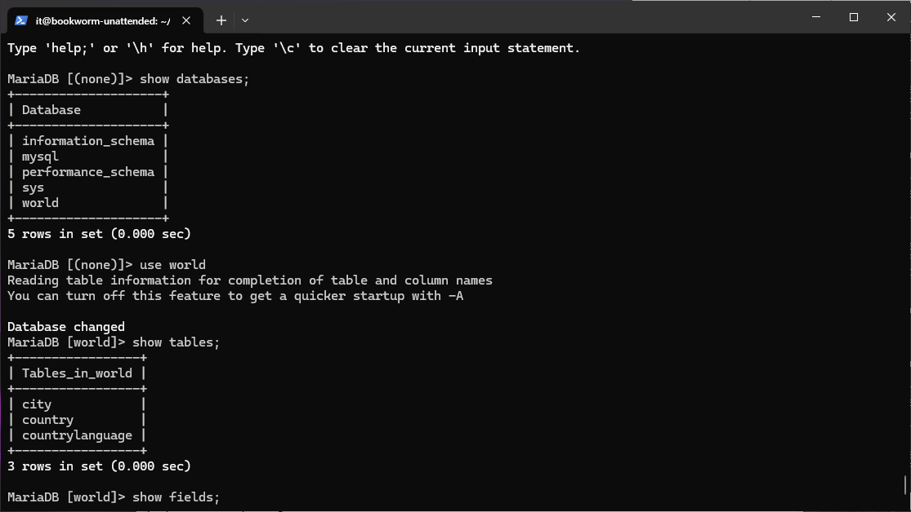

# \_LAMP, router, world db
Feb.2024
- [\_LAMP, router, world db](#_lamp-router-world-db)
  - [Intro](#intro)
  - [настраиваем виртуалку](#настраиваем-виртуалку)
    - [+ 2:20:00 mariaDB and others](#-22000-mariadb-and-others)
  - [Gateway](#gateway)
  - [Закидываев homepage](#закидываев-homepage)


## Intro
<details open><summary>Task Brief from Teams</summary>

|               |                              |
| ------------- | ---------------------------- |
| Лог Кирилла и там же скрипты роутера | [KNROUTER.html](_rsrc/krl/KNROUTER.html) |
| наш Debian Unattented ISO | debi12uefi.iso               |
| Гайд, задание | [ssl-o1G.txt](_rsrc/krl/ssl-o1G.txt)   |
| Гайд, задание | [ssl-up.sh](_rsrc/krl/ssl-up.sh)     |

</details>

Поставить LAMP на рутер, загрузить БД World (https://dev.mysql.com/doc/world-setup/en/), 
увидеть по адресу http://ufo.mars. Думаю уйдут оба дня т.к. в T412 был погром (железо осталось)

Добавил настройку SSL (для https://ufo.mars
arch (systemrecuecd) как всегда недопиленный. Не стал разбираться, будем использовать хост вмемто rabbit. Для этого в файл C:\Windows\System32\drivers\etc\hosts добавить строку "127.0.0.1       ufo.mars"
в VirtualBox порты задирать не будем: 22,80,443 остаются на месте
Подготовить рутер (прицепил ssl..)
Задание

Haписать скрипты
1. apache-up apache-down
2. maria-up maria-down
3. world-up world-down
4. php-up php-down

************

## настраиваем виртуалку
- На "роутере" ессно 2 адаптера Bridge/NAT & INTERNAL NETWORK
  - В случае с NAT пробрасываем порты ( 22, 80 , 443 ) порты
- Можем поставить Midnight Commander `sudo apt install mc wget`
- Можем так же накатить WinSCP на винду.
- C:\Windows\System32\drivers\etc\hosts вкидываем "127.0.0.1       ufo.mars"
- Хоумпагу в /var/www/html
- RTFM: https://www.digitalocean.com/community/tutorials/how-to-install-linux-apache-mariadb-php-lamp-stack-on-debian-10

берем ssl-up.sh

### + 2:20:00 mariaDB and others

************************************************************************************************************************************

## Gateway
- делаем router_up
- по желанию можем сделать host_rename
- ставим apache, бд, php:
```bash
sudo apt update && upgrade -y
sudo apt install -y apache2 mariadb-server mariadb-client php libapache2-mod-php php-mysql
php -v
```
Что тут ?
>`apache2`: Этот пакет устанавливает веб-сервер Apache, который используется для хостинга веб-сайтов и обслуживания веб-приложений.  
>`mariadb-server`: Этот пакет устанавливает сервер базы данных MariaDB, альтернативу MySQL. MariaDB - это реляционная база данных, широко используемая для веб-приложений.  
>`mariadb-client`: Этот пакет устанавливает клиентскую часть MariaDB, которая позволяет взаимодействовать с сервером базы данных MariaDB из командной строки или из скриптов.  
>`php`: Этот пакет устанавливает интерпретатор PHP, который используется для обработки серверных запросов и создания динамических веб-страниц.  
>`libapache2-mod-php`: Этот пакет устанавливает модуль Apache для поддержки PHP. Он позволяет Apache обрабатывать PHP-скрипты.  
>`php-mysql`: Этот пакет предоставляет PHP-расширение для взаимодействия с базами данных MySQL или MariaDB из PHP-скриптов. Оно позволяет PHP-приложениям выполнять запросы к базам данных и обрабатывать полученные данные.


- Проверяем из Workstation по DNS имени ufo.mars (10.0.10.1). Правильно ли DNS настроен на роутере:   


- Конфиг mysql (skip no no skip skip no skip)  
`sudo mysql_secure_installation`

- логинимся, сморим  
`sudo mysql -u root`  
`show databases;`  
`exit`  
  

- Скачиваем [WorldDB](https://dev.mysql.com/doc/index-other.html) и распаковываем:  
`wget https://downloads.mysql.com/docs/world-db.tar.gz`  
`cat world-db.tar.gz | gzip -d | tar xf -`

- отдаём в mysql нашу базу  
`mysql -u root < world-db/world.sql`

- Заходим в mysql, сморим чо там есть  
`sudo mysql`  
`\> show databases;`
должна появиццо новая база word ))  


```
use world;
show tables;
show fields;
describe city;
select Name, Population from city where name like "Tallinn";
```


## Закидываев homepage

***

...xxx