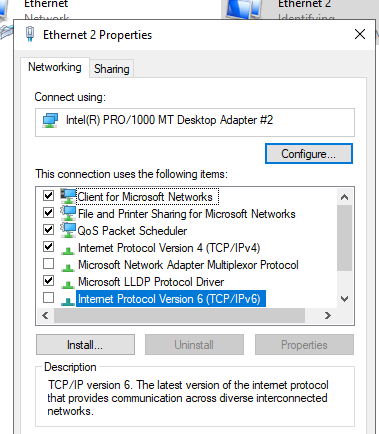
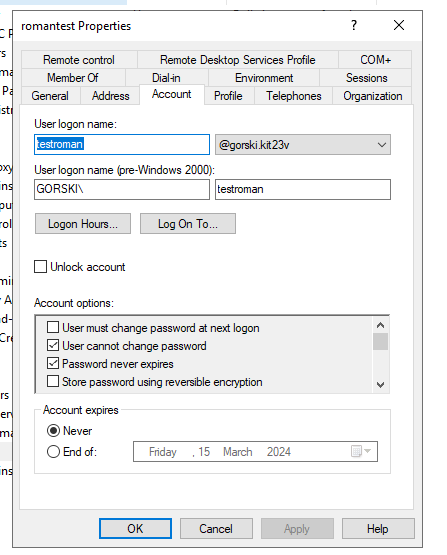
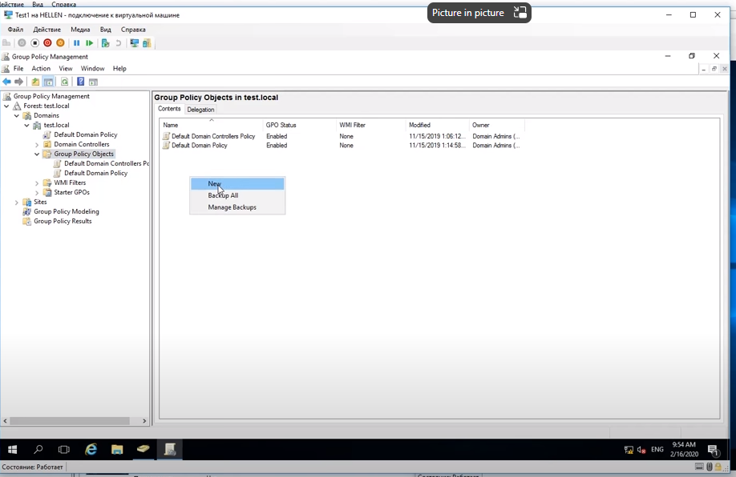
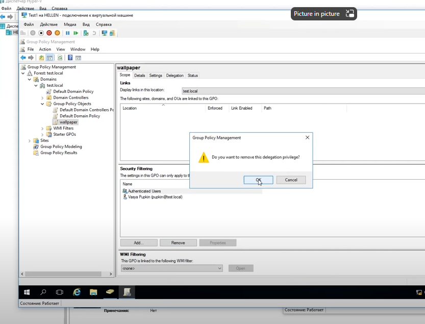
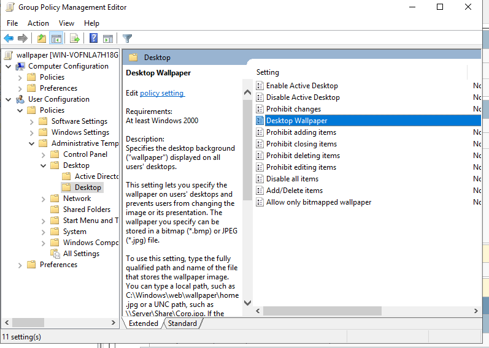

*** 

1) Ставим DNS, DHCP,
2) Ставим WDS загрузка по сети
3) Ставим AD, добавляем в домен меняем обоину

## Настройки Сервера в VirtualBox

- Наличие установленных VirtualBoxExtensions

- Желательно два NIC
1) Bridged Adapter - для связи с внешним миром (не обязтельно но желательно)
2) Internal Network - для внутренней виртульной сети

- Во избежание проблем отрубаем IPv6  

- Задаем обаа адрес статичными

## Ставим DNS, DHCP

********
esdtowim:

https://community.spiceworks.com/how_to/163540-convert-esd-to-wim

посмотреть чо там:
dism /Get-WimInfo /WimFile:install.esd

от админа

распаковать по индексу
dism /export-image /SourceImageFile:install.esd /SourceIndex:4 /DestinationImageFile:install.wim /Compress:max /CheckIntegrity

*******
domain:

0) domain name  

https://www.youtube.com/watch?v=WUS8G6SNVis

https://www.youtube.com/watch?v=j74z3LNZhnE&ab_channel=MerionAcademy

1) group policy Management  MMC  -> Group Policy Object

2) Security filtering -> add user (from Testname)   
3) Remove "Authentificated Users"  

gorski.kit23v

testroman

\\\Vboxsvr\wims\capy.jpg

************

add roles - > Active directory domain service

	Install AD with name: gorski.kit23v.local

	DHCP и DNS галочки должны быть поставлены + ip адрес должен быть зафиксирован

идём по галочке желтой для настройки AD

-> Add new forest: gorski.kit23v.local

gorski.kit23v

AD userc and computers

USERS:

new -> USER

1:33:00 !

