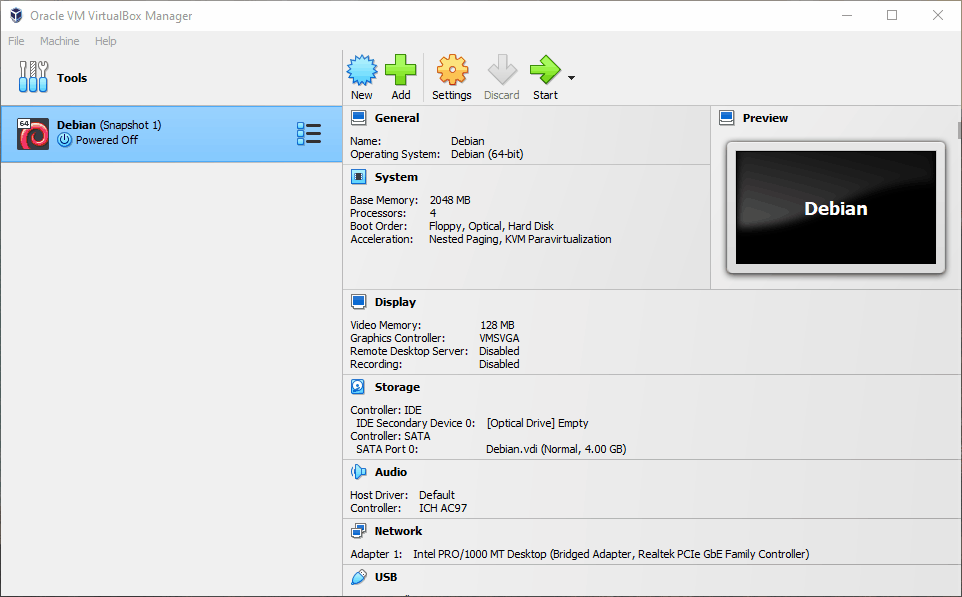
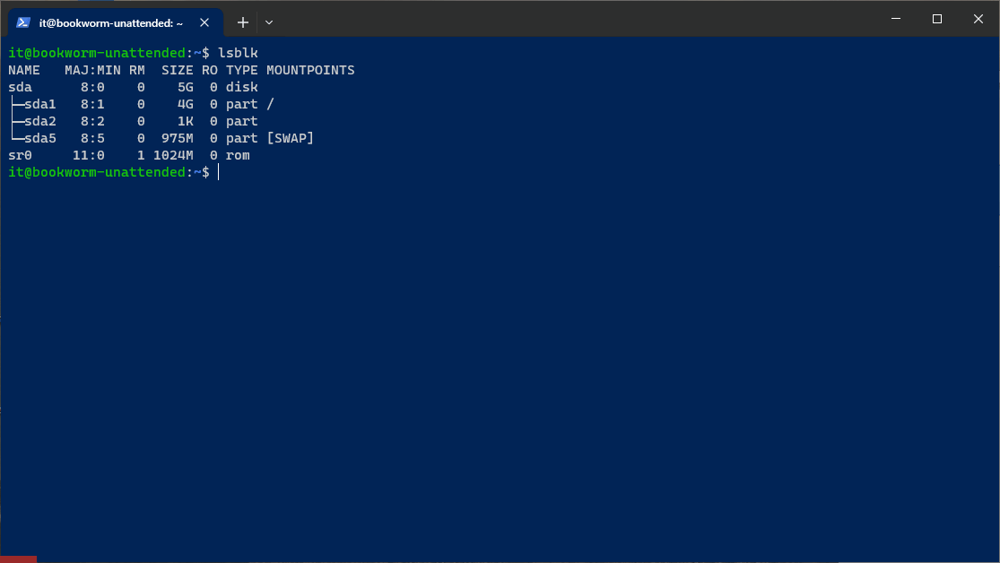

## \_FILES

> Read time: 5 min

- [Intro](#intro)
- [Создаём виртуальный HDD и цепляем к виртуалке](#создаём-виртуальный-hdd-и-цепляем-к-виртуалке)
- [Делаем раздел и форматируем в файловую систему (ext4)](#%D0%B4%D0%B5%D0%BB%D0%B0%D0%B5%D0%BC-%D1%80%D0%B0%D0%B7%D0%B4%D0%B5%D0%BB-%D0%B8-%D1%84%D0%BE%D1%80%D0%BC%D0%B0%D1%82%D0%B8%D1%80%D1%83%D0%B5%D0%BC-%D0%B2-%D1%84%D0%B0%D0%B9%D0%BB%D0%BE%D0%B2%D1%83%D1%8E-%D1%81%D0%B8%D1%81%D1%82%D0%B5%D0%BC%D1%83-ext4)
- [Делаем точку Монтирования](#%D0%B4%D0%B5%D0%BB%D0%B0%D0%B5%D0%BC-%D1%82%D0%BE%D1%87%D0%BA%D1%83-%D0%BC%D0%BE%D0%BD%D1%82%D0%B8%D1%80%D0%BE%D0%B2%D0%B0%D0%BD%D0%B8%D1%8F)
- [Создаём юзера и группу](#%D1%81%D0%BE%D0%B7%D0%B4%D0%B0%D1%91%D0%BC-%D1%8E%D0%B7%D0%B5%D1%80%D0%B0-%D0%B8-%D0%B3%D1%80%D1%83%D0%BF%D0%BF%D1%83)
- [Финальная часть для моего варианта или упрлс](#%D1%84%D0%B8%D0%BD%D0%B0%D0%BB%D1%8C%D0%BD%D0%B0%D1%8F-%D1%87%D0%B0%D1%81%D1%82%D1%8C-%D0%B4%D0%BB%D1%8F-%D0%BC%D0%BE%D0%B5%D0%B3%D0%BE-%D0%B2%D0%B0%D1%80%D0%B8%D0%B0%D0%BD%D1%82%D0%B0-%D0%B8%D0%BB%D0%B8-%D1%83%D0%BF%D1%80%D0%BB%D1%81)
    - [Если короче, то](#%D0%B5%D1%81%D0%BB%D0%B8-%D0%BA%D0%BE%D1%80%D0%BE%D1%87%D0%B5-%D1%82%D0%BE)
    - [Если еще короче](#%D0%B5%D1%81%D0%BB%D0%B8-%D0%B5%D1%89%D0%B5-%D0%BA%D0%BE%D1%80%D0%BE%D1%87%D0%B5)
- [In Result](#in-result)
- [Outro](#outro-alpacas)

* * *

## Intro

На примере моего варианта задания, и использованием VirtualBox. Хоть можно и встроенными средствами Windows создать VHD и подключить его вродь как даж к WSL (танцы с бубном). Но надёжней и безопасней проводить операции с разделами всёж на полноценной отдельной виртуалке, к тому же там можно быстро откатится назад через Snapshots в случае чего.

<details open><summary>Вводные данные от Кирилла</summary>

|     |     |
| --- | --- |
| Powershell скрипт | [myf.ps1.txt](_resources/myf.ps1.txt) |
| **История команд разных юзеров** | [histories-NBE.txt](_resources/histories-NBE.txt) |
| **История сессии** | [NelusKirillFiles-v31.html](_resources/NelusKirillFiles-v31.html) |
| **Варианты заданий** (у меня 9ый) | файл var-FILES-NBE 2.md в тимсе(сюда прикреплять не буду,  <br>посторонние личные данные) |
| Общение Кирилла с ботом | [draft-NBE.md](_resources/draft-NBE.md) |

</details>

> _По заданию - нужно создать файл/папку/симлинк определенного размера (в зависимости от вар-та), с определенными правами, определенной датой посл. изменения_.
>
> Мой вариант v9 - lrwxrwxrwx 1 Rex Vegetables 6 November 14 2023 Chi

- Мои допросы бота по теме задания ChatGPT: [Раз](Files_Chatbot.md), [Два](Files_Chatbot2.md).
- Что посмотреть:
    - [Пользователи, группы, права доступа / Linux](https://youtu.be/zCD6iqdhfVM?si=4Ga9rnP72Q92KmbC)
    - [Linux для Начинающих - Права Доступа и владения файлами и директориями](https://youtu.be/dR4DIo7HYoU?si=kPX7nV0S5Y0psDvF)
    - [Структура файлов и каталогов в Linux](https://youtu.be/WL2Xbndqy0k?si=56do-AlXCLyd0yIG)

## Создаём виртуальный HDD и цепляем к виртуалке

<details><summary>Вместо тысячи слов. GIF:</summary>



</details>

## Делаем раздел и форматируем в файловую систему (ext4)

- Коннектимся  
    `ssh it@<ip>`
    
- Заходим в рута и выполняем все дальнейшие комманды от его имени, что бы не вводить sudo перед каждой командой  
    `sudo -i`
    
- Видим что ничего пока не создали.  
    `lsblk`
    
- Делаем раздел по хоткею - **n**, все значения оставляем дефолтными по **Enter** и записываем на диск - **w**. ( Можно еще посмотреть хелп если нужно - **m**, или таблицу разделов - **p** )  
    `fdisk /dev/sdb`
    
- Видим что всё создали.  
    `lsblk`
    
- Форматируем в желаемую файловую систему (я выбрал ext4)  
    `mkfs.ext4 /dev/sdb1`
    
- Сморим в в корень © )  
    `ls /`
    
- Создаём папку куда будем монтировать   
    `mkdir -p /mnt/sdb1`
    

<details open><summary>Гифка из 3х этапов: До аттача VHD. После аттача. После создания раздела.</summary>



</details>

## Делаем точку Монтирования

- Монтируем /mnt/sdb1 и сморим что там есть.   
    `mount /dev/sdb1 /mnt/sdb1`  
    `ls -l /mnt/sdb1`  
    Там лишь lost+found - папка для мусора/битых файлов. Остальные 15 файлов скрытые

```bash
root@bookworm-unattended:~# ls -l /mnt/sdb1
total 16
drwx------ 2 root root 16384 Nov 25 09:55 lost+found
root@bookworm-unattended:~#
```

## Создаём юзера и группу

> &nbsp;**<ins>NB! Вообще большинство моих дальнейший действий ( типа `usermod -aG sudo Rex` , ключ `--allow-bad-names` , `date MMDDhhmm[[CC]YY][.ss]` , `&&`) не являются обязательными, и на оценку они не влияют. Но никогда не знаешь на сколько можно упртс и преисполниться ©, пытаясь из принципа сделать точно по ТЗ, даже если оно не совсем корректно)</ins>**  
> ****

- Добавляем юзера и группу <ins>своего варианта задания</ins>, можно и одной строкой через **&&**, поля оставляем дефолтные (just press Enter), задаём пассворд.  
    `adduser Rex --allow-bad-names && addgroup Vegetables --allow-bad-names`  
    Linux не любит когда создают имя пользователя начинающееся с большой буквы, поэтому мы используем ключ <ins>*\--allow-bad-names*</ins>, что бы обойти это. (Кирилл обходил это путём редактирования *passwd* и *group* )
    
- Можем посмотреть список пользователей/групп на машине посмотрев в файлы <ins>*/etc/passwd*</ins> и <ins>*/etc/group*</ins> соответственно. Список довольно не маленький , но меня интересует лишь последняя строка файла - последний добавленный юзер/группа: `сat /etc/passwd | tail -n 1` для пользователей и `cat /etc/group | tail -n 1` для групп.
    
    ```bash
    root@bookworm-unattended:~# cat /etc/passwd | tail -n 1
    Rex:x:1001:1001:,,,:/home/Rex:/bin/bash
    root@bookworm-unattended:~# cat /etc/group | tail -n 1
    Vegetables:x:1002:
    root@bookworm-unattended:~#
    ```
    
- Теперь нам надо поменять основную группу пользователя, т.к изначально он находится в одноименной группе Rex. Для этого есть свои команды со своими ньюансами, но Кирилл сделал проще - отредактировав */etc/passwd* файл.  
    Нас интересует 4 колонка последней строки, это GUID основной группы пользователя грубо говоря. Меняем его на 1002 и сохраняем  
    `nano /etc/passwd`
    
- Меняем группу на GUID - 1002
    

```bash
Rex:x:1001:**1002**:,,,:/home/Rex:/bin/bash\
```

- Выходим из под рута, он нам больше не понадобится  
    `exit`
    
    - Но <ins>конкретно в моём случае с моим вариантом,</ins> я перед выходом я прописал себя в sudoers, для дальнейшего выполнения задания (но вообще в реальной жизни делать так нежелательно).  
        `usermod -aG sudo Rex`
- Прерываем сессию (снова `exit`)и реконектимся по ssh под Rex, либо же - заходим сразу под ним, не прерывая ssh сеанс.  
    `su - Rex`
    
    ```bash
    root@bookworm-unattended:~# exit
    logout
    it@bookworm-unattended:~$ su - Rex
    Password:
    Rex@bookworm-unattended:~$ pwd
    /home/Rex
    Rex@bookworm-unattended:~$
    ```
    

## Финальная часть для моего варианта или упрлс

Что означает в моём варианте строка <ins>lrwxrwxrwx 1 Rex Vegetables 6 November 14 2023 Chi</ins> ?

Это символьная ссылка, созданная пользователем Rex из под Vegetables. Созданная/измененная 14 ноябя 2023 года, и занимающая на диске 6 байт. Помучав бота я понял что временем изменения всегда будет дата создания/обновления ссылки. И его [нельзя просто так взять и задать произвольным образом](https://donttakefake.com/wp-content/uploads/2020/06/The-Lord-of-the-Rings-dtf-magazine.jpg) как у файла (через `touch -t 202311141200` например ).   
Так же, нельзя записывать данные напрямую в ссылки (что логично), а под полем "место на диске" имеется ввиду - длина имени файла (ну или пути раз она относительная, а не абсолютная) на который указывает ссылка.

Если бы это был просто файл -rwxrwxrwx, то можно было сделать `touch -t 202311142112 Chi`, записать в него любых 6 байт (vi/ed/nano/cat), сделать `сhmod 777 Chi`. И на этом задание было бы выполнено. Вообщем я немогу поставить ни своё заданное время изменения, ни другие данные которые бы подходили под ТЗ.

Поэтому в кач-ве обходного пути я топорно изменю дату локального времени через `sudo date MMDDhhmm[[CC]YY][.ss]` и создам файл из 6 символов в имени `touch Alpaca`, на который будет ссылаться симлинк `ln -s Alpaca Chi`. Так же, мы не можем выполнять у юзера Rex команды от sudo, т.к он не прописан sudoers и у него нет прав, поэтому я приписал себя туда, в предыдущем разделе.

P.S: Форматы времени кстати у touch и date различны. `touch -t [[CC]YY]MMDDhhmm[.ss]` vs `date MMDDhhmm[[CC]YY][.ss]`

### Если короче, то

- Перемещаемся во времени чуть назад ( 14 ноября 23год )  
    `sudo date 1114070023`
    
- Создаём "Альпаку", на которую в итоге будет ссылка "занимающая" 6 байт как по ТЗ.  
    `touch Alpaca`
    
- И саму ссылку на неё под именем Chi:  
    `ln -s Alpaca Chi`
    
- Теперь "Кормим" Альпаку 6 любыми символами, <ins>в кач-ве пруфа что умеем записывать через cat</ins>.  
    `cat << end > Alpaca`
    
    ```bash
    Rex@bookworm-unattended:~$ cat << end > Alpaca
    > 12345
    > end
    ```
    
    Итого 6 байт (1 2 3 4 5 + символ перевода строки)
    
- Чмодим на всякий случай, <ins>кач-ве пруфа что мы знаем про chmod</ins>.  
    `сhmod 777 Alpaca`
    
- Перемещаемся теперь в будущее (14 ноября 24 год) , чтобы <ins>формат даты был как в ТЗ</ins>. Если измения были сделаны раньше/позже чем в близжайших 6 месяцев, то печатается год, в противном случае - время )  
    `sudo date 1114070024`
    
- ~~P.S: Можно было бы сделать `touch -t 199011141212 Alpaca` и отправить Альпаку в прошлое. <ins>В кач-ве пруфа что мы знаем про touch -t</ins>. Но я уже не стал заморачиваться~~.
    

### Если еще короче

- One
    
    ```bash
    sudo date 1114070023 \
    && touch Alpaca \
    && ln -s Alpaca Chi
    ```
    
- Two  
    `cat << end > Alpaca`
    
- Three  
    `sudo date 1114070024 && chmod 777 Alpaca`
    

## In Result

- Сморим. сравниваем  
    `ls -l && echo -e "---done----\nMy variant is: lrwxrwxrwx 1 Rex Vegetables 6 November 14 2023 Chi ^_^ "`
- Output

```bash
Rex@bookworm-unattended:~$ sudo date 1114070023 \
&& touch Alpaca \
&& ln -s Alpaca Chi
Tue Nov 14 07:00:00 AM UTC 2023
Rex@bookworm-unattended:~$ cat << end > Alpaca
> 12345
> end
Rex@bookworm-unattended:~$ sudo date 1114070024 && chmod 777 Alpaca
Thu Nov 14 07:00:00 AM UTC 2024
Rex@bookworm-unattended:~$ ls -l && echo -e "---done----\nMy variant is: lrwxrwxrwx 1 Rex Vegetables 6 November 14 2023 Chi ^_^ "
total 4
-rwxrwxrwx 1 Rex Vegetables 6 Nov 14  2023 Alpaca
lrwxrwxrwx 1 Rex Vegetables 6 Nov 14  2023 Chi -> Alpaca
---done----
My variant is: lrwxrwxrwx 1 Rex Vegetables 6 November 14 2023 Chi ^_^
```

- Лог [сессии](https://xprgclr.github.io/tpt/xfiles/), ну и [history](_resources/history.txt) на память.

&nbsp;

## Outro alpaca's

- 

* * *
