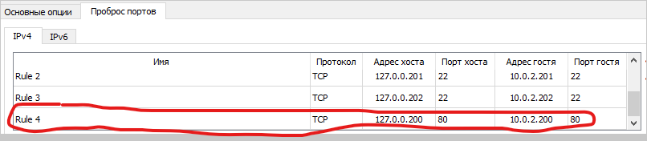
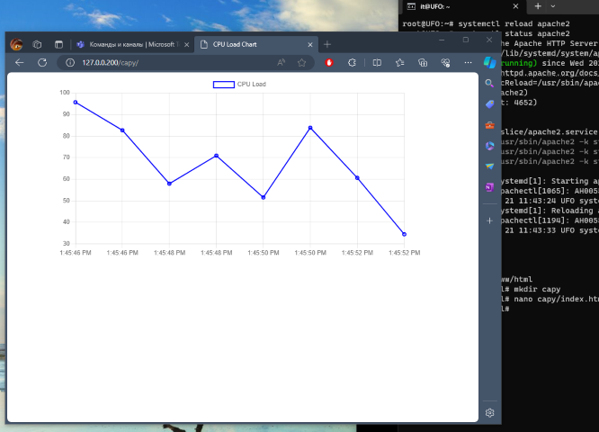

# _Monitoring
- [\_Monitoring](#_monitoring)
  - [Task Brief from Teams](#task-brief-from-teams)
  - [Intro](#intro)
  - [Install ~~LAMP~~ Apache \& Finish](#install-lamp-apache--finish)


## Task Brief from Teams

<details open><summary>Вводные данные от Кирилла [Open]</summary>

отправьте журнал установки (сеанс SSH с копированием и вставкой) и снимок экрана выполненной вами работы по мониторингу.
инструкции здесь

https://chat.openai.com/share/836c44c1-b3c2-4b43-b6b9-3f6a6a04c3c4

из " it seems Chart.js is not happy to have". До этого бот галлюцинировал

</details>


## Intro
- Настройки машины можно оставить как есть после предудыдущего задания ( NatNetwork ). Нам понадобиться только одна машина - она будет выступать в кач-ве веб-сервера ( LAMP ) и выдавать нам страничку со скриптом "мониторинга". Поэтому пробрасываем 80ый порт.  


- Ссылка на уже знакомую инструкцию по LAMP из прошлых заданий:  
https://www.digitalocean.com/community/tutorials/how-to-install-linux-apache-mariadb-php-lamp-stack-on-debian-10


## Install ~~LAMP~~ Apache & Finish

NB ! Кирилл ставил Apache, MariaDB, PHP. но можно обойтись и без них, т.к мы не работаем с БД. А так как наш скрипт на JS, то и php также можно не ставить. Просто скинем index.html со скриптом в нашу папку сайта.


- Заходим рутом чтоб не писать каждый раз sudo и ставим Apache:  
```bash
sudo -i 
apt install -y apache2
systemctl reload apache2
```
- Создаём "индексную" страничку сайта в отдельной папке и закидываем в index.html скрипт который выдал Кириллу ChatGPT.
```bash
cd /var/www/html
mkdir /capy
nano capy/index.html
```

- Проверяем с хоста, всё работает.




***
Сделать всё одним скриптом: 
- [mon_up.sh](_rsrc/mon_up.sh)

Сам index:  
- [index.html](_rsrc/index.html)
