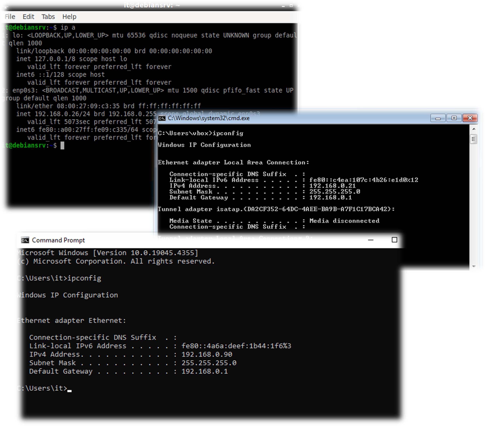
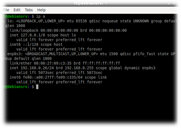
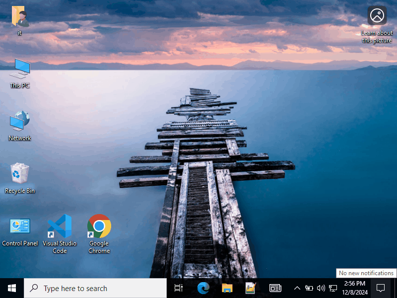
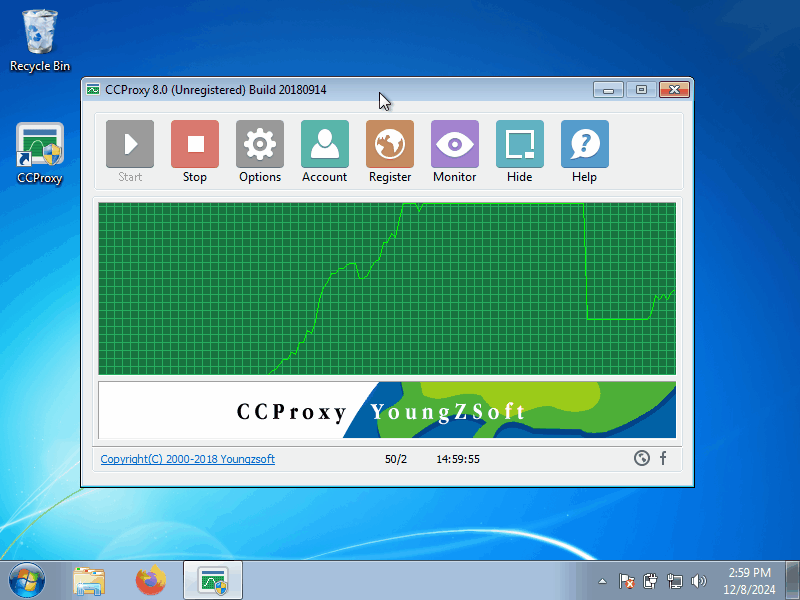
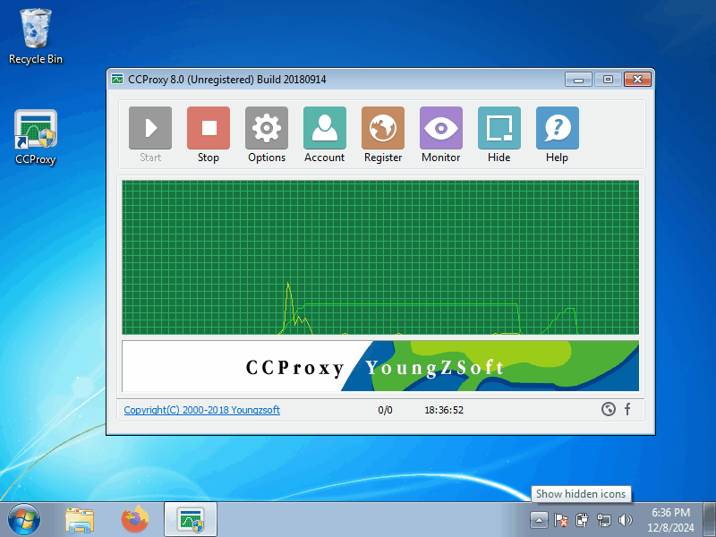

# Введение

CCProxy — это программное обеспечение, предназначенное для организации прокси-сервера на операционной системе Windows. Основная цель CCProxy — предоставление пользователям в локальной сети доступа к Интернету через единственное подключение. Программа поддерживает различные протоколы, включая HTTP, HTTPS, FTP, SMTP, POP3 и SOCKS, что делает её универсальным инструментом для управления сетевым трафиком.

Применение прокси-сервера через CCProxy позволяет:

- **Организовать общий доступ в Интернет** для локальной сети, даже если только одно устройство имеет прямое подключение к Интернету.
- **Контролировать доступ к сети** с помощью фильтров и авторизации пользователей.
- **Собирать статистику и вести журнал активности**, что полезно для анализа использования сети.
- **Оптимизировать** использование трафика, включая кэширование данных.

	 

  
CProxy отличается простотой настройки и широкими функциональными возможностями, что делает его подходящим как для образовательных целей, так и для реальных практических применений в небольших и средних организациях.
# Предварительные настройки

- Нужна машина в роли прокси-сервера, и клиент ( лучше два, на разных ОС )
- Все машины в “Bridged Mode”
- На машине в роли прокси серера ставим CCPoxy:
	- Сама программа [https://ccproxy.en.lo4d.com/windows](https://ccproxy.en.lo4d.com/windows)
	- Wiki: https://www.youngzsoft.net/ccproxy/wiki.htm,
	- Документация: https://docs.google.com/document/d/1nYFmlSwU8lYLZ2EnPIlsuHJ3LAFyvpRI/edit
- На прокси сервера для “чистоты теста” отключаем фаерволл     

- Запоминаем IP наших машин ( ip a ; ipconfig ) . В моём случае
	- Proxy server: 192.168.0.21
	- Linux client: 192.168.0.26
	- Windows client: 192.168.0.90

## Proxy Server

- Идём в options меняем 808 порт например на 8080. Жамкаем ОК.

## Сlients

На linux клиенте настройки для прокси сервера будем указывать в настройках браузера ( В моём случае – Firefox )
- Settings -> Network Settings -> Proxy
- Manual proxy configuration
- Там указываем адрес нашего прокси сервера и порт

- На Windows клиенте настройки для прокси сервера указываются на уровне системы в пункте настроек ОС

# Наблюдаем

- На сервере жамкаем Monitor-> Log
- На двух клиентах заходим на какие-либо сайты.
- В логах на сервере в разделе monitoring можно посмотреть логи в реалтайме

# Создаем пользователя

- Идём в «Account» меняем Permit Catergory c “Permit all” на “Permit Only”.  И создаем нового пользователя – New.
- Пока создаем ему имя и пароль, больше пока ничего не трогаем.+

- Перемещаемся для теста на linux машину и пробуем зайти на сайт, должно выскочить окно запроса ввода именя пользователя и пароля

·         Если имя/пароль неправильные то соотсветсвенно мы никуда не сможем зайти.

По поводу пунктов меню:

- Ip Address/ Ip range – тут указываем диапазон ip с которых возможно залогиниться под этим пользователем.
- Maximum Connections – ограничения по количеству одновременных соединений
- Download Bandwitch / Upload Bandwitch – ограничения по скорости на скачивание/отдачу

## Web Filer

Запрещает доступ к зоне zone.ee

- Можно посмотреть в логах

- Можно сделать поведение противоположным, запретить доступ ко всем сайтам кроме zone.ee, поставив галочку на Permitted Sites:

Кратко о разнице между Site Filter и Forbidden URL

|                        |                                     |                                   |
| ---------------------- | ----------------------------------- | --------------------------------- |
| Функция                | Site Filter                         | Forbidden URL                     |
| Тип списка             | Белый список (разрешение только)    | Чёрный список (блокировка)        |
| Поведение по умолчанию | Блокировать всё, кроме разрешённого | Разрешить всё, кроме запрещённого |
| Пример                 | Доступ только к edu.com             | Запрет на games.com               |
Site filter: С помощью Site Filter можно указать список сайтов, доступ к которым разрешён, блокируя остальные.

Forbidden URL: С помощью Forbidden URL можно указать список сайтов, доступ к которым запрещён, позволяя доступ ко всем остальным.