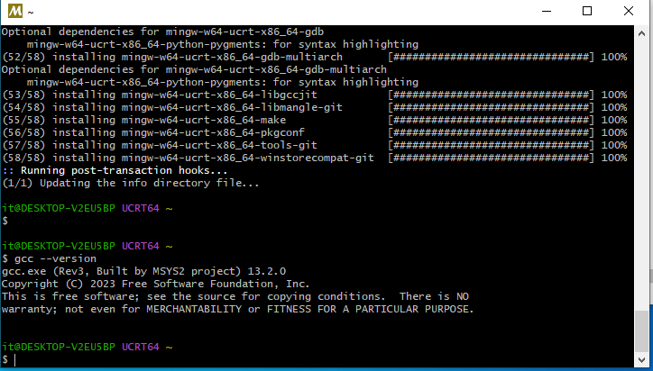
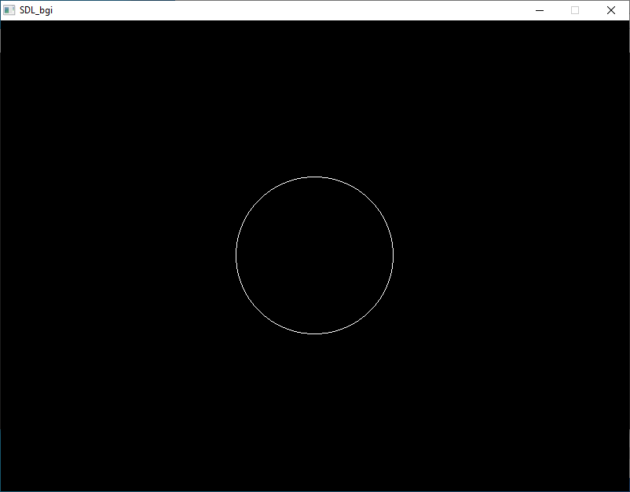

# Компилим C/C++ под винду с graphics.h (sdl_bgi)
- [Компилим C/C++ под винду с graphics.h (sdl\_bgi)](#компилим-cc-под-винду-с-graphicsh-sdl_bgi)
  - [Ставим "тулзы"](#ставим-тулзы)
  - [Ставим SDL\_bgi](#ставим-sdl_bgi)
  - [Настраиваем](#настраиваем)

## Ставим "тулзы"

RTFM:  
    https://code.visualstudio.com/docs/cpp/config-mingw  
    https://metanit.com/c/tutorial/1.2.php

Если кратко, то:

1. Ставим [VSCode](https://code.visualstudio.com/)
2. Ставим [Расширение](https://marketplace.visualstudio.com/items?itemName=ms-vscode.cpptools) для VSCode
3. Ставим [MSYS2](https://www.msys2.org/)
   1. Запускаем MSYS2.exe и ставим тулчейн:  
   `pacman -S --needed base-devel mingw-w64-ucrt-x86_64-toolchain`  
   ( Кстати в [гайде от metanit](https://metanit.com/c/tutorial/1.2.php) указывается что можно заюзать и `pacman -S mingw-w64-ucrt-x86_64-gcc`, в случае с Pure C )
   2. Добавляем путь `C:\msys64\ucrt64\bin` в PATH настройках Windows
   3. Тестим:
```
gcc --version
g++ --version
gdb --version
```



4. Создаем C исходник и компилим. (F5>GDB>gcc)

```c
#include <stdio.h>           
int main(void)                     
{                                   
    printf("Hello METANIT.COM!\n"); 
    return 0;                      
}  
```

## Ставим SDL_bgi

- Ставим SDL2. (P.S: В старых гайдах указаны папки/пути `mingw64`, у меня заменено на `ucrt64` )  
`pacman -Suy`    
`pacman -S mingw-w64-ucrt-x86_64-SDL2`  


- Читаем [The SDL_bgi Library](https://sdl-bgi.sourceforge.io/) и качаем - https://sourceforge.net/projects/sdl-bgi/files/SDL_bgi-3.0.0-win.zip. Внутри архива есть более подробная документация и manuals. Если кратко:

SDL_bgi Library ( SDL_bgi-3.x.x-win.zip ):
```bash
#!/bin/bash
set -x
cp src/graphics.h /ucrt64/include/
cp src/SDL_bgi.h /ucrt64/include/SDL2/
cp bin/MSYS2/SDL_bgi.dll /ucrt64/bin

```

## Настраиваем 

- Следуя докам по сайту **graphics.h** должен быть указан в include, и при компиляции должны быть следущие параметры:  
`gcc -o program.exe program.c -lmingw32 -L/ucrt64/bin -lSDL_bgi -lSDL2main -lSDL2 # -mwindows`

- Меняем **task.json** "проекта" в подкалатоге *.vscode*:


```json
{
    "tasks": [
        {
            "type": "cppbuild",
            "label": "C/C++: gcc.exe build active file",
            "command": "C:\\msys64\\ucrt64\\bin\\gcc.exe",
            "args": [
                "-fdiagnostics-color=always",
                "-g",
                "${file}",
                "-o",
                "${fileDirname}\\${fileBasenameNoExtension}.exe",
                "-lmingw32",
                "-L",
                "C:\\msys64\\ucrt64\\bin",
                "-lSDL_bgi",
                "-lSDL2main",
                "-lSDL2",
                //"-mwindows"
            ],
            "options": {
                "cwd": "${fileDirname}"
            },
            "problemMatcher": [
                "$gcc"
            ],
            "group": {
                "kind": "build",
                "isDefault": true
            },
            "detail": "Task generated by Debugger."
        }
    ],
    "version": "2.0.0"
}
```

- Берем например из папки test, примеры исходников и компилим их.

```c
  /* circle example */

#include <graphics.h>

int main(int argc, char *argv[])
{
  /* request autodetection */
  int gdriver = DETECT, gmode;
  int midx, midy, radius = 100;

  /* initialize graphics and local variables */
  initgraph(&gdriver, &gmode, "C:\\TC\\BGI");

  midx = getmaxx() / 2;
  midy = getmaxy() / 2;
  setcolor(getmaxcolor());

  /* draw the circle */
  circle(midx, midy, radius);

  /* clean up */
  getch();
  closegraph();
  return 0;
}
```

- Компилим. Done.  ( Примечание для запуска вне среды MSYS нужно чтобы dllки **SDL_bgi.dll** и **SDL2.dll** были в папке с исходником. )  
