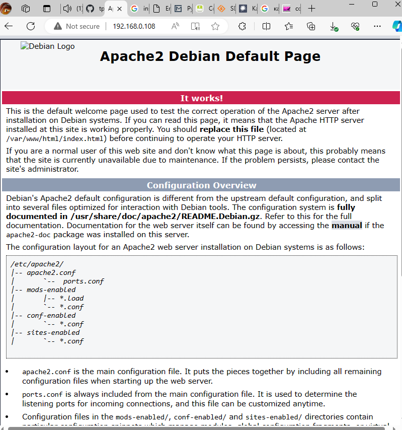
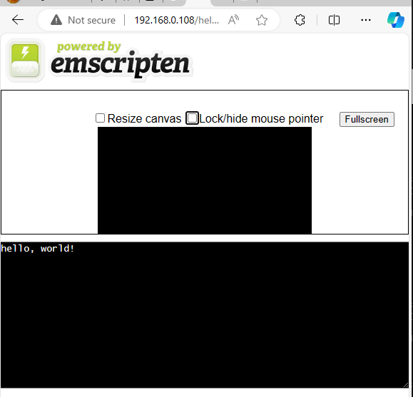

- [VSCode , SSH](#vscode--ssh)
- [Apache \& EMSDK](#apache--emsdk)
- [SDL \\ SDL\_BGI Lib](#sdl--sdl_bgi-lib)

## VSCode , SSH


## Apache & EMSDK

- Ставим

```bash
sudo apt update && sudo apt upgrade -y
sudo apt install -y python3 git cmake apache2 mc build-essential wget
```

- Чекаем по ip, с хоста. У меня виртуалка на http://192.168.0.108/  



- Ставим Emsdk
  
```bash
#!/bin/bash
cd ~
git clone https://github.com/emscripten-core/emsdk.git
cd emsdk/
./emsdk install latest
./emsdk activate latest
. ./emsdk_env.sh
```

- Ребутим, прописывает в автологин, проверяем.  
`. emsdk/emsdk_env.sh`
`./emcc -v`

- Делаем helloworld.c , компилим с emsdk, закидываем на "веб-серв"  
```bash
cat << eof > hello.c
#include <stdio.h>

int main() {
  printf("hello, world!\n");
  return 0;
}
eof

emcc hello.c -o hello.html
sudo cp hello.* /var/www/html
```

- Чекаем, 192.168.0.108/hello.html  
  


*******

...xxxx

## SDL \ SDL_BGI Lib


```bash
cd ~
git clone https://github.com/libsdl-org/SDL.git -b SDL2
cd SDL/
mkdir build
cd build
../configure
make
sudo make install
```

...xxxx
..