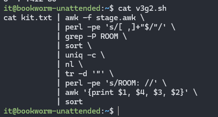
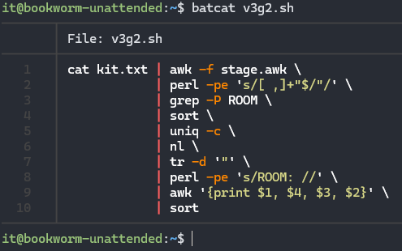

## \_REGEX

> Read time: 3 min

- [Intro](#intro)
- [Предпоготовка и досрочное выполнение задания](#предпоготовка-и-досрочное-выполнение-задания)
- [Делаем по уму](#делаем-по-уму)
- [Основа регулярки, сам скрипт в моём варианте задания](#основа-регулярки-сам-скрипт-в-моём-варианте-задания)
- [Наводим красоту](#наводим-красоту)
- [Finish](#finish)

* * *

## Intro


<details open><summary>Вводные данные от Кирилла</summary>

|     |     |
| --- | --- |
| **Список расписания**  <br>**для моего варианта** | [KIT23V-ALL.txt](_resources/KIT23V-ALL.txt) |
| **Варианты задания** | var-13112023.md ( в тимсе ) |
| **Пример решения от кирилла** | [nelus\_kirill.html](_resources/nelus_kirill.html) |
| **Tunniplaani Analyzer** | [kirill.tpt.edu.ee/timeTable-N21.html](http://kirill.tpt.edu.ee/timeTable-N21.html) |
| Гайд по Регуляркам | [Регулярные выражения. Всё проще, чем кажется / Хабр (habr.com)](https://habr.com/ru/articles/567106/) |
| Раскрашиваем терминал | [Разукрашиваем вывод в консоли: теория и практика / Хабр (habr.com)](https://habr.com/ru/companies/macloud/articles/558316/) |

</details>

> _По заданию - Есть 4 списка расписания в "Raw-формате", нужно отформатировать один из них согласно своему варианту задания. И написать скрипт/подобрать регулярку для вывода данных в соответсвии с нашим вариантом._
> 
> Мой вариант v3g2: How many rooms are in timetable in KIT-23V.txt ( Сколько классов в таблице, в группе KIT-23V )

[Мои расспросы ChatGpt о stage1.awk](aboutScripts.md)


## Предпоготовка и досрочное выполнение задания

- Коннектимся  
    `ssh it@<ip>`
    
- создаём текстовый файл из нашего варианта задания и заполняем его  
    `touch kit.txt && nano kit.txt`
    
- Создаём AWK файл и заполняем его скриптом Кирилла из "**[Tunniplaani Analyzer](http://kirill.tpt.edu.ee/timeTable-N21.html)"**  
    `touch stage.awk && nano stage.awk`
    
- Читаем, гуглим про регулярки и пробуем сделать по ТЗ путем практики и перебора. В конце концов моя моя грепка нашлась.
    
    ```bash
    cat kit.txt | grep -P Ruum \
                | sort \
                | uniq -c \
                | nl \
                | awk '{print $1, $3, $4, $2}'
    ```
    
    получаем вывод
    
    ```text
    1 Ruum A-A307 22
    2 Ruum A-A310 12
    3 Ruum A-A410 1
    4 Ruum T-T411 32
    5 Ruum T-T412 80
    it@bookworm-unattended:~$
    ```
    
    Впринципе задание на этом выполнено без всяких awk , bash скриптов и громозких регулярок. Но для усвоения материала, желательно пройтись по всем темам которые упоминал Кирилл.
    

## Делаем по уму

- Неплохо бы отформатировать кита через скрипт Кирилла. Делаем. Сохраняем в отдельный файл для удобства
    
    `cat kit.txt | awk -f stage.awk > formatted_kit.txt`
    
- Cмотрим  
    `cat formatted_kit.txt`  
    Скоре всего там будет "жижа":
    
    ```text
    },
    "ROOM":    "T-T412 "
    "TEAM":    "KIT-23V "
    },
    "ROOM":    "T-T412 "
    "TEAM":    "KIT-23V "
    },
    "ROOM":    "T-T412 "
    "TEAM":    "KIT-23V "
    },
    ```
    
- Если так, то ставим gawk, повторяем попытку форматирования и смотрим
    
    `sudo apt install gawk`  
    `cat kit.txt | awk -f stage.awk > formatted_kit.txt`  
    `cat formatted_kit.txt`
    
- Любуемся, всё ок.
    
    ```text
    ...
    {
    "DATETIME":"Kolmapäev 15.11.202316:10-16:55 "
    "SUBJECT": "Windows-operatsioonisüsteemide kasutus"
    "TEACHER": "Vadim Veeremaa  "
    "ROOM":    "T-T412 "
    "TEAM":    "KIT-23V "
    },
    {
    "DATETIME":"Kolmapäev 15.11.202317:05-17:50 "
    "SUBJECT": "Windows-operatsioonisüsteemide kasutus"
    "TEACHER": "Vadim Veeremaa  "
    "ROOM":    "T-T412 "
    "TEAM":    "KIT-23V "
    },
    ```
    

## Основа регулярки, сам скрипт в моём варианте задания

Мне подфартило с вариантом в этом задании (в отличии от задания FILES). Мне достаточно сменить изначальную выборку с TEACHERов на ROOMсы (но с другой стороны, справедливости ради -  я подобрал регулярку под свой вар-т досрочно ^\_^ без AWK и лишних телодвижений) .

- создаём наш баш скрипт с именем нашего варианта - v3g2.sh  
    `touch v3g2.sh && nano v3g2.sh`
- Копипастим и сохраняем скрипт Кирилла, предварительно изменив TEACHER на ROOM в двух местах:

```bash
cat kit.txt | awk -f stage.awk \
            | perl -pe 's/[ ,]+"$/"/' \
            | grep -P ROOM \
            | sort \
            | uniq -c \
            | nl \
            | tr -d '"' \
            | perl -pe 's/ROOM: //' \
            | awk '{print $1, $4, $3, $2}' \
            | sort
```

- Смотрим список файлов  
    `ls - l`
    
    ```text
    -rw-r--r-- 1 it it 26328 Nov 25 17:40 formatted_kit.txt
    -rw-r--r-- 1 it it 17060 Nov 25 17:39 kit.txt
    -rw-r--r-- 1 it it   529 Nov 25 17:40 stage.awk
    -rw-r--r-- 1 it it   294 Nov 25 17:41 v3g2.sh
    ```
    
    - *kit.txt* - сырой кит
    - *formatted\_kit.txt* - отформатированный кит
    - *stage.awk* - скрипт из Tunniplaani Analyzer
    - *v3g2.sh* - модифицированный баш скрипт (v1g2.sh) Кирилла под мой вариант задания. Из прикрепов в тимс.
- Запускаем смотрим, работает.  
     `bash v3g2.sh`
    
    ```text
    it@bookworm-unattended:~$ bash v3g2.sh
    1  A-A307 22
    2  A-A310 12
    3  A-A410 1
    4  T-T411 32
    5  T-T412 80
    ```
    

## Наводим красоту

Нужно отправить вывод баш скрипта в html с подсветкой, но стандартный cat выводит пресную картинку:  
`cat cat v3g2.sh`



- На уроке, для красивостей вывода в терминале мы использовали batcat, которого по умолчанию скорей всего не будет из "под коробки". Cтавим  
    `sudo apt update && sudo apt install bat -y`
- Смотрим им на наш скрипт - теперь другое дело.  
    `batcat v3g2.sh`  
    

## Finish

- Копируем наш скрипт в удобоваримый html и обзываем в формате &lt;ИмяФамилияВариант&gt; и отправляем эту мелкую [htmlку](https://xprgclr.github.io/tpt/regEX/bash.html) в тимс. Насколько я понял - её достаточно.

***

P.S: На всякий случай..
- [v3g2.sh](_resources/v3g2.sh)
- [хистори](_resources/v3g2_hist.txt)
- [сессия](https://xprgclr.github.io/tpt/regEX/)
- [v3g2.html](https://xprgclr.github.io/tpt/regEX/bash.html)

